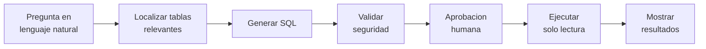

# GraphSQL
> Sistema multi-agente que traduce preguntas en **lenguaje natural** a consultas **SQL de solo lectura**

## 1. Motivación y Problema

El proyecto nace de conversaciones con compañeros de trabajo sobre el desconocimiento generalizado de SQL y de cómo los equipos técnicos terminan siendo el cuello de botella para cualquier consulta sobre datos. La idea era explorar si se podría construir una herramienta interna de soporte que ayude tanto a recién llegados como a veteranos a lidiar con bases de datos grandes sin necesitar conocerlas al dedillo. No es un proyecto comercial, sino de I+D sobre agentes y cómo aplicarlos en contextos de negocio reales.

El problema concreto que aborda: las bases de datos relacionales son el repositorio central de información de la mayoría de empresas, pero acceder a ellas exige conocer SQL, conocer el esquema exacto (nombres de tablas y columnas) y entender relaciones que rara vez están documentadas. Esto crea una **brecha de acceso** entre los datos y quienes los necesitan:

- Los **analistas de negocio** dependen del equipo técnico para obtener informes ad hoc.
- Los **directivos** no pueden explorar datos de forma autónoma.
- Los **desarrolladores** pierden tiempo en consultas de bajo valor.
- Las bases de datos grandes (200+ tablas) son inabordables incluso para técnicos si no conocen el dominio.


## 2. Objetivos

| # | Objetivo |
|---|---|
| O1 | Traducir preguntas en lenguaje natural a consultas SQL correctas y seguras |
| O2 | Funcionar sobre bases de datos grandes sin conocimiento previo del esquema |
| O3 | Soportar consultas multilingüe (español → esquema en inglés) |
| O4 | Garantizar seguridad: solo operaciones de lectura, con aprobación humana |
| O5 | Reutilizar consultas pasadas validadas como ejemplos *few-shot* |
| O6 | Minimizar el coste en llamadas a LLM mediante una arquitectura eficiente |

## 3. Cómo funciona (idea)

El usuario escribe una pregunta en lenguaje natural. Varios agentes especializados colaboran para **localizar las tablas relevantes**, **generar la SQL**, **validar que es segura** (solo lectura), **pedir aprobación** al usuario y, tras el visto bueno, **ejecutarla y mostrar los resultados**.

```
┌─────────────────────────────────────────────────────────────┐
│                          Usuario                            │
│   "Muéstrame las 10 categorías con más ventas este año"     │
└─────────────────────────┬───────────────────────────────────┘
                          │ Lenguaje natural
                          ▼
┌─────────────────────────────────────────────────────────────┐
│                        GraphSQL                             │
│   ┌──────────┐  ┌──────────┐  ┌──────────┐  ┌──────────┐    │
│   │ Memory   │→ │ Schema   │→ │   SQL    │→ │  Judge   │    │
│   │  Agent   │  │  Agent   │  │  Agent   │  │  Agent   │    │
│   └──────────┘  └──────────┘  └──────────┘  └──────────┘    │
│                                     │                        │
│                                     ▼                        │
│         Aprobación humana → Ejecución segura → Resultados    │
└─────────────────────────────────────────────────────────────┘
```

Flujo de una consulta:



## 4. Tecnologías (visión general)

- **TypeScript (Node.js 20+)** — lenguaje del proyecto.
- **LangGraph.js** — orquestación del flujo entre agentes.
- **Neo4j** — esquema de la base de datos como grafo de conocimiento (GraphRAG).
- **PostgreSQL + pgvector** — memoria y búsqueda semántica.
- **Modelo de lenguaje (LLM) configurable** — OpenAI (nube) o un modelo local (LM Studio); genera y valida la SQL.
- **CLI en terminal** — `@inquirer/prompts` + `boxen` + `chalk`.

> El *porqué* de algunas decisiones técnica se documenta en [`docs/design/arquitectura.md`](docs/design/arquitectura.md) a medida que se toma.

## 5. Estado actual

Voy construyendo el sistema por fases (*spec-first*); esta sección crece a medida que valido cada pieza. Lo que ya funciona:

- ✅ **Infraestructura** — Docker Compose con PostgreSQL + pgvector y Neo4j; el dataset de pruebas *Arcadia* se carga al arrancar y está validado.
- ✅ **Acceso a la BD objetivo** — puerto `ITargetDatabase` con un adaptador Postgres que fuerza la sesión en **solo lectura**.
- ✅ **Proveedor LLM configurable** — puerto `IChatModel` + factory que crea OpenAI (nube) o un modelo local de LM Studio, eligiendo por configuración.
- ✅ **CLI en terminal** — cabecera, menú y selección de proveedor; puedo conversar con el modelo (`npm start`).
- ✅ **Primer grafo LangGraph** — conversa con estado (checkpointer por hilo) y completa acciones llamando a *tools*, tanto con OpenAI como en local.
- ✅ **Ingesta del esquema en Neo4j** — escaneo de la BD objetivo (tablas, columnas, claves) y volcado a un grafo de conocimiento (nodos `Table`/`Column`, relaciones `HAS_COLUMN`/`REFERENCES`), disparable desde el CLI o como *tool* del agente.
- ✅ **Vectorización del esquema en pgvector** — cada tabla se embebe (con OpenAI o un modelo local de LM Studio, a elegir) y se guarda para la búsqueda semántica; descripciones opcionales sincronizadas en Neo4j y pgvector.
- ✅ **Recuperación GraphRAG (Schema Agent)** — dada una pregunta, encuentra las tablas relevantes combinando la búsqueda semántica en pgvector con la expansión por claves foráneas en Neo4j; expuesta como *tool* de schema-linking. Encuentra incluso tablas de nombre opaco por su descripción.
- ✅ **SQL Agent (NL→SQL)** — a partir de la pregunta y el contexto recuperado, genera la consulta SQL en el dialecto de la BD objetivo (inyectado en el prompt); expuesto como *tool* `generar_sql`.
- ✅ **Judge (validación de seguridad y corrección)** — antes de ejecutar nada, una barrera por capas comprueba la SQL: una **Capa 1** pura y determinista (debe empezar por `SELECT`/`WITH`, sin palabras de escritura ni patrones de inyección), una **Capa 2** que valida la sintaxis real contra la BD con `EXPLAIN` (sin ejecutar), y un **juez LLM** opcional que aporta confianza, avisos y sugerencias. Bloquean solo las capas deterministas (1 y 2); el juez LLM no bloquea por sí solo, para que un falso positivo no tumbe una consulta válida. El veredicto se muestra junto a la SQL en el chat.

- ✅ **Ejecución segura (solo lectura)** — ejecuta una consulta ya validada contra la BD objetivo y devuelve las filas. Antes de tocar la BD vuelve a comprobar la seguridad (última barrera, lanza error si no es de solo lectura); la sesión es de solo lectura; aplica un tope de filas (marcando si se trunca) y un `statement_timeout`.
- ✅ **Revisión humana (aprobación con *interrupt*)** — un pipeline propio (recuperación → SQL → Judge → **revisión** → ejecución) que se **para** antes de ejecutar: LangGraph pausa con `interrupt_before` y persiste el estado en PostgreSQL (recuperable por `thread_id`). Desde el CLI veo la consulta y el veredicto del Judge en cajas con color y decido: **aprobar** (ejecuta), **rechazar** (termina), **modificar** la SQL a mano (vuelve al Judge) o **fijar tablas y relanzar** (rehace la recuperación con esas tablas fijadas). Ninguna SQL se ejecuta sin mi visto bueno.

Lo siguiente es el **supervisor** (SPEC-10), que une todo el pipeline y añade el reintento automático Judge↔SQL. El detalle del plan está en [`docs/design/SPEC.md`](docs/design/SPEC.md).

## Documentación del proyecto

- [`docs/design/arquitectura.md`](docs/design/arquitectura.md) — diseño detallado (incremental, se completa por fases).
- [`docs/design/SPEC.md`](docs/design/SPEC.md) — especificación e historial de componentes (SDD).


