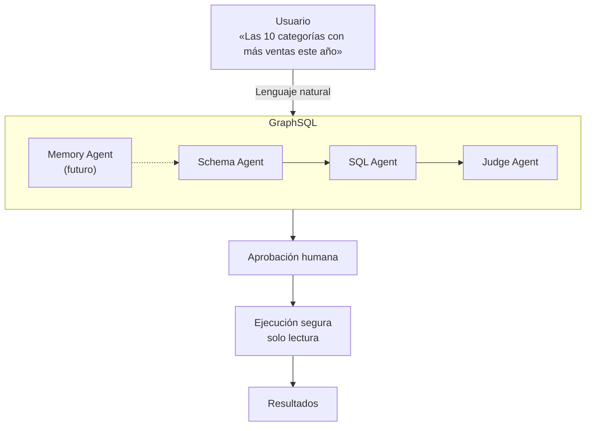

# GraphSQL

> Sistema multi-agente que traduce preguntas en **lenguaje natural** a consultas **SQL de solo lectura**, sin que el usuario conozca el esquema de la base de datos.

**[Instalación](docs/instalacion.md) · [Uso](docs/uso.md) · [Estructura](docs/estructura.md) · [Arquitectura](docs/design/arquitectura.md) · [Evaluación](docs/evaluacion/) · [Glosario](docs/glosario.md)**

Escribes *"¿qué 10 juegos se han jugado más este año?"* y GraphSQL localiza las tablas que hacen falta, genera la SQL, comprueba que es segura, te la enseña para que la apruebes y, con tu visto bueno, la ejecuta y te da el resultado. Es un proyecto de I+D (TFM) sobre agentes de IA aplicados a un problema real de empresa, no un producto comercial.

## Vídeo
https://drive.google.com/file/d/1GgBV_FfgNhEuS0mvEkkYOQAFEkTAZcdC/view?usp=sharing

## Slides
https://docs.google.com/presentation/d/16LKJP_4HHANkCc18VnEeWul8F6ZdK5LUim754vXnuZk/edit?usp=sharing

## El problema que resuelve

Las bases de datos relacionales guardan la información de casi cualquier empresa, pero para consultarlas hay que saber SQL, conocer el nombre exacto de tablas y columnas, y entender relaciones que rara vez están documentadas. Eso deja fuera a quien más necesita los datos: los analistas dependen del equipo técnico, los directivos no exploran por su cuenta, y en una base de datos grande (200+ tablas) ni los técnicos se aclaran si no conocen el dominio. GraphSQL pone una capa de lenguaje natural encima para cerrar esa brecha.

## Objetivos

| # | Objetivo |
|---|----------|
| O1 | Traducir preguntas en lenguaje natural a SQL correcta y segura |
| O2 | Funcionar sobre bases de datos grandes sin conocer el esquema de antemano |
| O3 | Consultar en un idioma sobre un esquema en otro (español → esquema en inglés) |
| O4 | Garantizar seguridad: solo lectura, con aprobación humana antes de ejecutar |
| O5 | Minimizar el coste en llamadas al LLM con una recuperación de contexto eficiente |

> Hubo un sexto objetivo, el Memory Agent, que quedó fuera del MVP por alcance. Está con el
> resto de lo pendiente en [Trabajo futuro](#trabajo-futuro).

## Cómo funciona

El usuario pregunta en lenguaje natural. Varios agentes especializados colaboran para **localizar las tablas relevantes**, **generar la SQL**, **validar que es segura**, **pedir aprobación** y, tras el visto bueno, **ejecutarla y mostrar el resultado**.


```mermaid
flowchart TD
    U["Usuario<br/>«Las 10 categorías con más ventas este año»"]
    U -->|Lenguaje natural| GS
    subgraph GS [GraphSQL]
        direction LR
        MA["Memory Agent<br/>(futuro)"] -.-> SA[Schema Agent]
        SA --> SQL[SQL Agent]
        SQL --> JA[Judge Agent]
    end
    GS --> H[Aprobación humana]
    H --> E[Ejecución segura<br/>solo lectura]
    E --> R[Resultados]
```

> Es la vista simplificada. El flujo real añade el bucle automático Judge↔SQL y las cuatro
> opciones de la revisión (aprobar / rechazar / modificar / afinar). El grafo completo está en
> [`arquitectura.md` §3](docs/design/arquitectura.md).

La pieza central es el **Schema Agent (GraphRAG)**: en vez de darle al LLM el esquema entero, busca las tablas parecidas a la pregunta por significado (vectorial) y añade las que están conectadas por clave foránea (grafo en Neo4j). Así el LLM recibe **solo las tablas que necesita**, con un contexto pequeño aunque la base de datos sea enorme.

## Puesta en marcha

Necesitas **Node.js 20+**, **Docker** (Desktop en Windows/Mac, Engine + Compose v2 en Linux) y un proveedor de LLM (ver abajo). La forma recomendada es el **instalador de un comando**, que descarga el proyecto, lo configura preguntándote lo mínimo y registra el comando global **`gsql`**:

```powershell
# Windows (PowerShell)
irm https://raw.githubusercontent.com/Arfeon/tfm-sql-agents/main/install.ps1 | iex
```

```bash
# Linux / macOS
curl -fsSL https://raw.githubusercontent.com/Arfeon/tfm-sql-agents/main/install.sh | bash
```

Después, escribe `gsql`: la primera vez, el propio CLI levanta y comprueba su infraestructura (contenedores y datos de prueba) guiándote. La misma instalación **hecha a mano** (cuatro comandos, con qué deberías ver en cada punto y las notas por sistema operativo) está en la [guía paso a paso](docs/instalacion-paso-a-paso.md):

```bash
cp .env.example .env         # 1. proveedor de LLM/embeddings (lo demás ya funciona)
cp descriptions/descriptions.example.json descriptions/descriptions.json   # 2. descripciones de la BD de prueba
cd backend && npm install    # 3. el ÚNICO npm install del repo
npm start                    # 4. abre el CLI, que levanta y comprueba el resto
```

¿Solo quieres **evaluar la demo, sin instalar Node ni clonar el repo**? Las imágenes están publicadas en Docker Hub; basta Docker y un fichero:

```bash
curl -fsSL -O https://raw.githubusercontent.com/Arfeon/tfm-sql-agents/main/docker-compose.hub.yml
docker compose -f docker-compose.hub.yml run --rm cli
```

Detalle (y la variante construyendo la imagen desde el repo) en la [guía de la demo con Docker](docs/instalacion-docker.md).

La infraestructura (Postgres con las BDs de prueba y Neo4j) se puede levantar de dos maneras, y las dos acaban en el mismo sitio:

- **Guiada (por defecto)** — el propio `npm start` comprueba que Docker está en marcha y que los contenedores existen y están sanos; si falta algo, te avisa y se ofrece a crearlos con la configuración por defecto. No hace falta saber Docker.
- **Manual** — `docker compose up -d --wait` desde la raíz, antes de arrancar el CLI. El `--wait` devuelve el prompt cuando los servicios están `healthy`.

En el CLI: primero **"Escanear el esquema"** (construye el grafo y el índice), luego **"Consultar en lenguaje natural"**. Guía paso a paso en [`docs/uso.md`](docs/uso.md).

**Proveedor de LLM** (se elige al arrancar el CLI, que muestra el modelo para que siempre sepas cuál usas):
- **Nube (OpenAI)**: rápido, con coste; el proyecto está medido con `gpt-5-mini`. Necesitas poner tu clave en el `.env` (`OPENAI_API_KEY`); el instalador te la pide y la escribe él.
- **Local (LM Studio), 100% offline y sin coste**: recomiendo `Qwen2.5-Coder-14B` como chat y `bge-m3` como embeddings, con el servidor de LM Studio arrancado y **los dos modelos cargados a la vez** ([cómo dejarlo listo](docs/instalacion.md#modo-local-los-modelos-de-lm-studio)). Pensado para que ni las preguntas ni el esquema salgan de la red.
- **Gateway corporativo (LiteLLM y compatibles)**: un servidor propio de la organización que habla la API de OpenAI y decide él qué modelo hay detrás. Es el modo pensado para empresa: las preguntas y el esquema no salen del perímetro, y el gateway concentra la clave, la cuota y la traza. Se configura con `GATEWAY_BASE_URL`, `GATEWAY_API_KEY` y `GATEWAY_MODEL` (el *alias* que publica el gateway).

**¿Usuario y contraseña?** GraphSQL no tiene login: es un CLI local. Las únicas credenciales son las de la infraestructura de demo (Postgres y Neo4j), y ya vienen puestas en `.env.example` con un valor que funciona tal cual (usuarios `postgres` / `neo4j`, contraseña `graphsql_local`). No hace falta cambiarlas: los contenedores son locales y desechables.

## Qué sabe hacer

- **Encuentra las tablas por significado**, no por nombre exacto: da con `customer` cuando preguntas por "clientes", casa español con un esquema en inglés, y localiza incluso tablas de nombre opaco (`t_042`) por su descripción.
- **Aguanta esquemas grandes de verdad** (probado contra un ERP real de ~800 tablas): cuando la pregunta va dominada por un tema ("qué *abonado* tiene más líneas de *fibra*") y la tabla clave queda enterrada en el ranking, la rescatan tres capas extra — ranking híbrido (palabras + significado), caminos de FK en el grafo y un selector LLM que elige las tablas razonando. Explicado con ejemplos en [`arquitectura.md` §6](docs/design/arquitectura.md).
- **Genera y valida la SQL** con un Judge por capas: seguridad determinista (solo `SELECT`/`WITH`), sintaxis real contra la BD (`EXPLAIN`) y un juez LLM que aconseja; si algo falla, reintenta solo hasta 3 veces antes de enseñártela.
- **No ejecuta nada sin tu aprobación**: te muestra la SQL y el veredicto, y decides aprobar, rechazar, editarla a mano o **afinarla** con una indicación en lenguaje natural. La pausa se guarda y es recuperable.
- **Ejecuta en solo lectura** (sesión read-only, tope de filas, timeout) y enseña el resultado como tabla o gráfico de barras en la terminal.
- **Se auto-documenta el esquema** (opcional, SPEC-27): un LLM redacta una frase por tabla a partir de sus columnas, sus claves y —si lo autorizas— una muestra de filas, y la deja en `descriptions/<bd>.json`. Es la palanca medida con más impacto en la recuperación: una descripción sube una tabla del puesto ~60 al top del ranking. Con modelo en la nube, enviar la muestra exige **consentimiento explícito**; con modelo local, los datos no salen de la máquina.
- **Proveedor y prompts configurables**: nube o local sin tocar código; los prompts de los agentes viven en [`agents/*.md`](agents) y se editan como texto.
- **Se puede medir**: incluye un arnés de evaluación reproducible (ver resultados abajo).

El MVP está **completo y funcional** de punta a punta. Lo que queda fuera de alcance está recogido en [Trabajo futuro](#trabajo-futuro).

## Resultados

Lo medible y sólido — el detalle y **cómo se interpretan las métricas** están en [`docs/evaluacion/`](docs/evaluacion/):

- **La recuperación funciona con poco contexto.** GraphRAG trae ~99% de las tablas correctas con la mitad del contexto que volcar el esquema entero, y ese contexto **se mantiene plano** al crecer la base de datos (de 17 a 66 tablas: 774 → 759 tokens, mientras el esquema entero se dispara a 5.748).
- **Las descripciones + el grafo son lo que salva las bases de datos reales.** Con tablas de nombre opaco, volcar el esquema entero se hunde aunque lleve las descripciones; solo con recuperación se aprovechan.
- **Funciona igual de bien 100% en local.** Verificado con `Qwen2.5-Coder-14B`: GraphRAG sobre Nebula (66 tablas) da **87% de acierto y 93% de equivalencia con ~760 tokens** — cerca de la nube y sin que nada salga de la red.

## Stack

**TypeScript** (Node.js 20+) · **LangGraph.js** (orquestación) · **Neo4j** (esquema como grafo de conocimiento) · **PostgreSQL + pgvector** (búsqueda semántica y checkpoints) · **LLM configurable** (OpenAI, LM Studio o un gateway corporativo) · **CLI** (`@inquirer/prompts`, `boxen`, `chalk`).

En desarrollo usé **LangSmith** (capa gratuita de la suite LangChain) para trazar y depurar los grafos; es opcional, se activa por variables de entorno y va **apagado por defecto** — con esquemas reales lo coherente con el despliegue on-premise es no encenderlo (o auto-alojar una alternativa como Langfuse). Detalle en [`arquitectura.md` §7](docs/design/arquitectura.md).

## Estructura del proyecto

Así está organizado el repo a primer nivel:

```
tfm-sql-agents/
├── agents/                  # los prompts de cada agente, en Markdown editable (sin recompilar)
├── backend/                 # todo el código TypeScript (aquí va el único npm install)
│   ├── src/
│   │   ├── cli/             # capa de presentación: arranque guiado, menús y flujos
│   │   ├── graphsql/        # el sistema en sí, en capas (explicado justo debajo)
│   │   ├── datasets/        # seeds deterministas de las BDs de demo (arcadia, nebula)
│   │   └── evaluation/      # los scripts del arnés de evaluación (npm run evaluate)
│   └── tests/               # unit / integration / diagnostic (ver más abajo)
├── descriptions/            # descripciones de tablas por BD (JSON); al repo solo van los .example
├── docs/                    # instalación, uso, arquitectura, evaluación, glosario, proceso
├── setup/                   # scripts de init que cargan los contenedores al crearse
├── docker-compose.yml       # la infraestructura local: Postgres+pgvector y Neo4j
├── docker-compose.hub.yml   # la demo desde Docker Hub, sin clonar el repo
└── install.ps1 / install.sh # el instalador de un comando
```

Dentro de `backend/src/graphsql/` el código sigue **clean architecture**: `domain` (tipos y reglas puras) ← `application` (casos de uso) ← `infrastructure` (adaptadores) y `orchestration` (los grafos LangGraph). Cómo encajan las capas, el patrón **puerto + adaptador + factory** con el que entra todo recurso externo y la estrategia de **tests** (dependencias inyectadas, tres suites) están explicados con ejemplos en [`docs/estructura.md`](docs/estructura.md).

## Despliegue

El objetivo es **on-premise**: GraphSQL se conecta a la base de datos corporativa y maneja su esquema y sus datos, así que su sitio es dentro del perímetro de la organización (por eso existe el modo local, para que nada salga de la red). No hay instancia en nube pública a propósito; la entrega es esta instalación reproducible con Docker Compose, base directa de un despliegue en Kubernetes sobre servidores propios. El razonamiento está en la decisión D-14 ([arquitectura.md §7](docs/design/arquitectura.md)).

## Trabajo futuro

Todo esto queda **fuera del MVP** pero está especificado; el detalle por componente está en [`docs/design/SPEC.md`](docs/design/SPEC.md) y la visión más amplia en [`arquitectura.md` §11](docs/design/arquitectura.md):

- **Memory Agent (SPEC-09)** — reutilizar consultas ya aprobadas como ejemplos *few-shot* para el SQL Agent. Era el sexto objetivo original.
- **Relaciones sintéticas en el grafo (SPEC-22)** — aristas curadas a mano para bases de datos **sin claves foráneas declaradas** (un ERP viejo, una BD de un tercero que no puedo tocar): viven solo en Neo4j y el GraphRAG las usa como si fueran reales.
- **Índice multi-inquilino (SPEC-20)** — tener varias bases de datos indexadas a la vez y cambiar entre ellas sin re-escanear.
- **Continuidad conversacional (SPEC-16, SPEC-12)** — preguntas de seguimiento sobre una consulta, y nombrar/listar/reanudar conversaciones.
- **Interfaz gráfica (fuera del CLI)** — una UI para el flujo pregunta → revisión → resultado, más allá de la terminal. La lógica ya está desacoplada de la presentación; falta decidir la tecnología (React, Flutter o Angular) y construirla.
- **Golden set sobre el ERP real (backlog de SPEC-26)** — la recuperación por capas está validada contra el ERP real (~800 tablas) de forma cualitativa (fue el caso que la motivó); falta un golden set pequeño que mida con el mismo arnés la contribución de cada capa (léxico, grafo, selector).

## Documentación

- [`docs/instalacion.md`](docs/instalacion.md) — índice de instalación (qué vía elegir) y el instalador de un comando.
- [`docs/instalacion-paso-a-paso.md`](docs/instalacion-paso-a-paso.md) — la misma instalación hecha a mano, con un "deberías ver" en cada paso.
- [`docs/instalacion-docker.md`](docs/instalacion-docker.md) — evaluar la demo solo con Docker, sin instalar Node ni clonar el repo.
- [`docs/instalacion-avanzada.md`](docs/instalacion-avanzada.md) — la infraestructura a mano: Docker Compose, verificaciones, el init y regenerar datos.
- [`docs/uso.md`](docs/uso.md) — guía de uso paso a paso: consultar, escanear, depurar.
- [`docs/estructura.md`](docs/estructura.md) — cómo está organizado el código: capas, patrón puerto/adaptador/factory y tests.
- [`docs/design/arquitectura.md`](docs/design/arquitectura.md) — diseño y decisiones técnicas.
- [`docs/design/SPEC.md`](docs/design/SPEC.md) — especificación por componente (SDD).
- [`docs/evaluacion/`](docs/evaluacion/) — qué se mide, cómo se interpreta y los resultados.
- [`docs/glosario.md`](docs/glosario.md) — los términos que uso (GraphRAG, schema-linking, ablation…), explicados.
- [`docs/proceso/`](docs/proceso/) — el rastro de cómo hice el TFM (diario, investigación, plan). No es documentación de uso.
