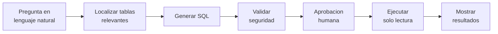

# GraphSQL — Diseño detallado y arquitectura

## 1. Motivación y problema

Acceder a una base de datos relacional exige conocer SQL y el esquema exacto (tablas, columnas, relaciones), lo que crea una **brecha de acceso** entre los datos y quien los necesita. El problema se agrava en bases grandes (200+ tablas). Detalle del problema y objetivos en el [README](../../README.md).

## 2. Visión de la solución

Pipeline **multi-agente** orquestado con LangGraph: agentes especializados localizan las tablas relevantes, generan la SQL, la validan, piden aprobación humana y la ejecutan en solo lectura.

```
┌─────────────────────────────────────────────────────────────┐
│                          Usuario                            │
│   "Muéstrame las 10 categorías con más ventas este año"     │
└─────────────────────────┬───────────────────────────────────┘
                          │ Lenguaje natural
                          ▼
┌─────────────────────────────────────────────────────────────┐
│                        GraphSQL                             │
│   ┌──────────┐  ┌──────────┐  ┌──────────┐  ┌──────────┐    │
│   │ Memory   │→ │ Schema   │→ │   SQL    │→ │  Judge   │    │
│   │  Agent   │  │  Agent   │  │  Agent   │  │  Agent   │    │
│   └──────────┘  └──────────┘  └──────────┘  └──────────┘    │
│                                     │                        │
│                                     ▼                        │
│         Aprobación humana → Ejecución segura → Resultados    │
└─────────────────────────────────────────────────────────────┘
```



## 3. Arquitectura técnica (grafo de estados)


## 4. Los agentes


## 5. Grafo de conocimiento (Neo4j)

Modelo el esquema relacional de la BD objetivo como un grafo en Neo4j, porque un esquema *es* un grafo: tablas unidas por claves foráneas. Tenerlo así me deja, dada una tabla candidata, expandir a las relacionadas siguiendo las FKs (lo que necesito para los JOINs).

**Modelo de datos (lo ya implementado):**

```
(:Table)-[:HAS_COLUMN]->(:Column)
(:Table)-[:REFERENCES {from_column, to_column}]->(:Table)   // una por cada clave foránea
```

- `Table`: `name`, `full_name`, `schema`, `primary_keys`, `column_count`.
- `Column`: `name`, `type`, `nullable`, `is_primary_key`, `table_name`.
- `REFERENCES`: relación dirigida de la tabla con la FK hacia la tabla referenciada, guardando las columnas origen/destino.

**Ingesta.** Leo el esquema de la BD objetivo (vía `information_schema` en PostgreSQL) y lo vuelco en dos pasadas: primero todos los nodos `Table` con sus `Column`, y después las relaciones `REFERENCES` (cuando ya existen todas las tablas). Antes de reimportar limpio el grafo, y aseguro `Table.name` único con un constraint. El escaneo se dispara desde el CLI o como *tool* del agente.

**Pendiente (SPEC-03).** Sobre este grafo añadiré la capa semántica: descripciones y conceptos, y la recuperación que combina búsqueda vectorial (pgvector) para encontrar tablas candidatas con la expansión por FKs en el grafo para traer las relacionadas.

## 6. Memoria vectorial (PostgreSQL + pgvector)


## 7. Decisiones técnicas

**TypeScript (Node.js 20+).** Tengo más soltura con el lenguaje y `@langchain/langgraph`, `neo4j-driver` y `@langchain/openai` cubren todo lo que necesito; la toolchain de Node me simplifica el entorno de desarrollo en Windows.

**LangGraph (orquestación).** Mi flujo es una máquina de estados determinista con un bucle de reintento y una pausa para aprobación humana. LangGraph lo modela de forma nativa: routing por reglas sobre el estado (sin LLM supervisor), *checkpointers* para persistir el estado e `interrupt_before` para el *human-in-the-loop*. Frente a un agente ReAct (indeterminista, una llamada LLM por decisión de routing), es más predecible, auditable y barato. **Descarto ReAct.**

**Neo4j (grafo de conocimiento del esquema).** El esquema relacional es intrínsecamente un grafo (tablas unidas por claves foráneas). Modelarlo en Neo4j me permite expandir desde una tabla candidata a las relacionadas siguiendo las FKs (necesario para los JOINs) y añadir nodos de descripción/concepto para el caso multilingüe (`pedido` ↔ `order`). **Lo combino con pgvector**: vector para encontrar tablas candidatas, grafo para expandir por relaciones.

**PostgreSQL + pgvector, no Qdrant (memoria vectorial).** Ya necesito PostgreSQL para los *checkpoints* de LangGraph; pgvector reutiliza esa misma instancia → una pieza de infraestructura en lugar de dos. A la escala de mi proyecto, no aprovecharía las ventajas de Qdrant.

**CLI en terminal, no web (interfaz).** Lo que quiero estudiar son los agentes, no la capa de presentación; el patrón pregunta → aprobación → ejecución encaja con un REPL de terminal y me reduce la infraestructura. La monto con `@inquirer/prompts` (menús y captura de texto), `boxen` (cabecera) y `chalk` (color). Puedo desacoplar la lógica de la presentación, así que dejo una web como mejora futura.

**Supervisor determinista, no LLM (routing).** El flujo sigue una secuencia fija; un LLM supervisor añadiría llamadas por cada decisión de routing para llegar a la misma conclusión. Reglas sobre el estado → más barato, predecible y auditable.

## 8. Seguridad


## 9. Evaluación experimental


## 10. Mejoras futuras

Líneas abiertas más allá del MVP (visión, no alcance entregable):

- **Aprendizaje continuo evaluado**: que el sistema evalúe la calidad de sus respuestas y mejore con el uso.
- **Explotación BI / visualización**: detectar resultados "graficables" y generar gráficos o paneles → *análisis conversacional* ("muéstrame las ventas por mes" devuelve un gráfico).
- Interfaz web, generación automática de descripciones del esquema.
