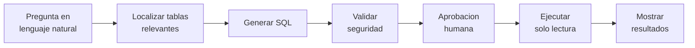
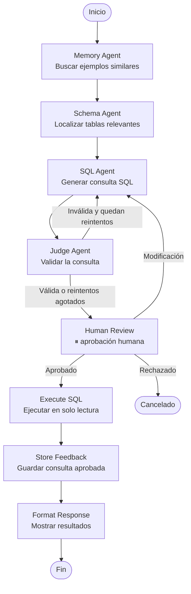

# GraphSQL — Diseño detallado y arquitectura

## 1. Motivación y problema

Acceder a una base de datos relacional exige conocer SQL y el esquema exacto (tablas, columnas, relaciones), lo que crea una **brecha de acceso** entre los datos y quien los necesita. El problema se agrava en bases grandes (200+ tablas). Detalle del problema y objetivos en el [README](../../README.md).

## 2. Visión de la solución

Pipeline **multi-agente** orquestado con LangGraph: agentes especializados localizan las tablas relevantes, generan la SQL, la validan, piden aprobación humana y la ejecutan en solo lectura.

```
┌─────────────────────────────────────────────────────────────┐
│                          Usuario                            │
│   "Muéstrame las 10 categorías con más ventas este año"     │
└─────────────────────────┬───────────────────────────────────┘
                          │ Lenguaje natural
                          ▼
┌─────────────────────────────────────────────────────────────┐
│                        GraphSQL                             │
│   ┌──────────┐  ┌──────────┐  ┌──────────┐  ┌──────────┐    │
│   │ Memory   │→ │ Schema   │→ │   SQL    │→ │  Judge   │    │
│   │  Agent   │  │  Agent   │  │  Agent   │  │  Agent   │    │
│   └──────────┘  └──────────┘  └──────────┘  └──────────┘    │
│                                     │                        │
│                                     ▼                        │
│         Aprobación humana → Ejecución segura → Resultados    │
└─────────────────────────────────────────────────────────────┘
```



## 3. Arquitectura técnica (grafo de estados)

El pipeline de una consulta lo monto como una máquina de estados en LangGraph: cada paso es un agente y, según cómo queda el estado compartido (la pregunta, las tablas recuperadas, la SQL, lo que diga el Judge…), se decide el siguiente. El enrutado lo llevo con reglas, no con un LLM: el flujo es siempre el mismo, así que no necesito que un modelo decida por dónde seguir.

De momento tengo el esqueleto del grafo (SPEC-01) y la ingesta/vectorización del esquema (SPEC-02/03); los agentes los voy montando a partir de SPEC-04 (el estado de cada uno está en [SPEC.md](SPEC.md)).



Lo importante del flujo es la pausa para aprobar la SQL antes de ejecutarla: el nodo de revisión humana detiene el grafo (`interrupt_before`), guarda el estado y espera mi decisión; cuando respondo, sigue donde estaba. Hoy el estado se guarda en memoria; cuando lo necesite lo paso a PostgreSQL.

## 4. Los agentes

De estos, el **Schema Agent** (la recuperación GraphRAG) ya está hecho (SPEC-04); los demás los voy montando. La idea de cada uno:

- **Supervisor.** Decide el siguiente paso con reglas sobre el estado, sin LLM.
- **Memory** (opcional). Busca consultas pasadas parecidas y se las pasa como ejemplos al SQL Agent. Es lo primero que recorto si voy justo de tiempo.
- **Schema** (el GraphRAG). Encuentra las tablas que hacen falta combinando la búsqueda por significado en pgvector (da con `customer` cuando escribo "clientes") y la expansión por claves foráneas en Neo4j para arrastrar las tablas relacionadas que necesitan los JOIN.
- **SQL.** Escribe la consulta a partir de la pregunta y de las tablas que le pasa el Schema Agent (y de los ejemplos del Memory Agent, si los hay).
- **Judge.** Revisa que la SQL sea segura. Lo primero y obligatorio es comprobar que solo lee (empieza por `SELECT`/`WITH`, sin palabras peligrosas ni inyección); si eso falla, no se ejecuta diga lo que diga el resto. Por encima puede ir una comprobación de sintaxis y una revisión con el propio LLM.
- **Human Review.** Me enseña la SQL y espera a que la apruebe, la rechace o la corrija.
- **Execute.** Ejecuta la consulta aprobada en solo lectura y devuelve los resultados.
- **Store Feedback.** Guarda la consulta aprobada para reutilizarla como ejemplo. Si falla, no rompe nada (no es crítico).
- **Format.** Pinta la SQL y los resultados en el CLI; los agentes devuelven datos y la presentación es cosa aparte.

## 5. Grafo de conocimiento (Neo4j)

Modelo el esquema relacional de la BD objetivo como un grafo en Neo4j, porque un esquema *es* un grafo: tablas unidas por claves foráneas. Tenerlo así me deja, dada una tabla candidata, expandir a las relacionadas siguiendo las FKs (lo que necesito para los JOINs).

**Modelo de datos (lo ya implementado):**

```
(:Table)-[:HAS_COLUMN]->(:Column)
(:Table)-[:REFERENCES {from_column, to_column}]->(:Table)   // una por cada clave foránea
```

- `Table`: `name`, `full_name`, `schema`, `description` (opcional), `primary_keys`, `column_count`.
- `Column`: `name`, `type`, `nullable`, `is_primary_key`, `table_name`.
- `REFERENCES`: relación dirigida de la tabla con la FK hacia la tabla referenciada, guardando las columnas origen/destino.

**Ingesta.** Leo el esquema de la BD objetivo (vía `information_schema` en PostgreSQL) y lo vuelco en dos pasadas: primero todos los nodos `Table` con sus `Column`, y después las relaciones `REFERENCES` (cuando ya existen todas las tablas). Antes de reimportar limpio el grafo, y aseguro `Table.name` único con un constraint. El escaneo se dispara desde el CLI o como *tool* del agente.

Sobre este grafo se apoya la recuperación: la búsqueda vectorial (pgvector) encuentra las tablas candidatas y la expansión por FKs en el grafo trae las relacionadas. La capa de descripciones/conceptos enriquece ambos.

## 6. Memoria vectorial (PostgreSQL + pgvector)

Uso PostgreSQL + pgvector (en la base `graphsql_memory`) para la búsqueda semántica de tablas: encontrar `customer` cuando el usuario dice "clientes", o casar una pregunta en español con un esquema en inglés. Reutilizo la instancia que ya necesito para los checkpoints de LangGraph, así que es una pieza de infraestructura, no dos.

**Vectorización del esquema (lo ya implementado).** Al escanear, por cada tabla compongo un texto (`Tabla: <nombre>. Columnas: <...>`, más la descripción si la hay), lo embebo y lo guardo en `table_embeddings`: el texto de búsqueda, el `embedding vector(N)`, el proveedor, el modelo y la dimensión usados, y la descripción cruda en su propia columna. Guardar el proveedor/modelo/dimensión deja el índice autodescrito, para que el retriever consulte con el mismo modelo. La tabla se reconstruye entera en cada vectorización.

**Proveedor de embeddings configurable.** Detrás del puerto `IEmbeddings` hay un adaptador OpenAI-compatible que sirve para OpenAI (`text-embedding-3-small`, 1536) y para un modelo local en LM Studio (`bge-m3`); el proveedor se elige al escanear, igual que el del chat.

**Principio innegociable.** Indexo y consulto con el **mismo modelo**: la similitud solo tiene sentido dentro del mismo espacio vectorial. Por eso guardo el modelo y la dimensión con cada vector, la dimensión de la columna es configurable, y cambiar de modelo obliga a una re-vectorización explícita (con aviso). Detalle en [`docs/investigacion/embeddings.md`](../investigacion/embeddings.md).

**Recuperación (SPEC-04, hecho).** Dada una pregunta, busco las tablas candidatas por significado en pgvector y las expando por claves foráneas en Neo4j para componer el contexto (tablas relevantes + DDL) que usará el SQL Agent. A esta escala uso búsqueda exacta por coseno, sin índice ANN.

## 7. Decisiones técnicas

**TypeScript (Node.js 20+).** Tengo más soltura con el lenguaje y `@langchain/langgraph`, `neo4j-driver` y `@langchain/openai` cubren todo lo que necesito; la toolchain de Node me simplifica el entorno de desarrollo en Windows.

**LangGraph (orquestación).** Mi flujo es una máquina de estados determinista con un bucle de reintento y una pausa para aprobación humana. LangGraph lo modela de forma nativa: routing por reglas sobre el estado (sin LLM supervisor), *checkpointers* para persistir el estado e `interrupt_before` para el *human-in-the-loop*. Frente a un agente ReAct (indeterminista, una llamada LLM por decisión de routing), es más predecible, auditable y barato. **Descarto ReAct.**

**Neo4j (grafo de conocimiento del esquema).** El esquema relacional es intrínsecamente un grafo (tablas unidas por claves foráneas). Modelarlo en Neo4j me permite expandir desde una tabla candidata a las relacionadas siguiendo las FKs (necesario para los JOINs) y añadir nodos de descripción/concepto para el caso multilingüe (`pedido` ↔ `order`). **Lo combino con pgvector**: vector para encontrar tablas candidatas, grafo para expandir por relaciones.

**PostgreSQL + pgvector, no Qdrant (memoria vectorial).** Ya necesito PostgreSQL para los *checkpoints* de LangGraph; pgvector reutiliza esa misma instancia → una pieza de infraestructura en lugar de dos. A la escala de mi proyecto, no aprovecharía las ventajas de Qdrant.

**CLI en terminal, no web (interfaz).** Lo que quiero estudiar son los agentes, no la capa de presentación; el patrón pregunta → aprobación → ejecución encaja con un REPL de terminal y me reduce la infraestructura. La monto con `@inquirer/prompts` (menús y captura de texto), `boxen` (cabecera) y `chalk` (color). Puedo desacoplar la lógica de la presentación, así que dejo una web como mejora futura.

**Supervisor determinista, no LLM (routing).** El flujo sigue una secuencia fija; un LLM supervisor añadiría llamadas por cada decisión de routing para llegar a la misma conclusión. Reglas sobre el estado → más barato, predecible y auditable.

## 8. Seguridad

La seguridad es lo que no me quiero saltar. De todo esto ya están montadas y probadas varias cosas: la sesión de solo lectura (el adaptador de Postgres abre la conexión en modo `READ ONLY`, así que un INSERT falla aunque me equivoque) y el **Judge** (SPEC-06) con sus capas: la **Capa 1**, un validador puro que rechaza cualquier sentencia que no sea claramente de solo lectura (debe empezar por `SELECT`/`WITH`, sin palabras de escritura ni patrones de inyección); la **Capa 2**, un `EXPLAIN` contra la BD que comprueba la sintaxis real sin ejecutar; y la **Capa 3**, un juez LLM que aporta confianza y avisos pero que no bloquea por sí solo (puede ser demasiado estricto). Quien bloquea son las capas deterministas (1 y 2). El **ejecutor** (SPEC-07) ya está: ejecuta en solo lectura, vuelve a pasar la comprobación de seguridad como última barrera (lanza `UnsafeQueryError` si algo no fuera de solo lectura) y limita filas y tiempo. Falta la **aprobación humana** (SPEC-08) que se interponga antes de ese ejecutor.

Lo que quiero garantizar:

- **Solo lectura**: rechazo cualquier consulta que no empiece por `SELECT`/`WITH`.
- **Nada de operaciones peligrosas ni inyección**: detecto palabras como `DROP`, `DELETE`, `INSERT`, `UPDATE`… y patrones tipo `;`, `--` o `/* */`.
- **Aprobación humana**: nada se ejecuta sin que yo dé el visto bueno.
- **Usuario sin permisos de escritura** en la BD objetivo: la última defensa está en el motor, no en mi código (esto ya está).
- **Secretos solo en el `.env`**: nunca en el código ni en los logs.
- **No registro** consultas con datos sensibles.

Antes de entregar repaso que cada punto tenga al menos un test que lo compruebe.

## 9. Evaluación experimental

Quiero poder enseñar que el GraphRAG sirve de algo, no solo decirlo. El problema es que los modelos ya han visto los esquemas públicos de siempre (Northwind, Chinook…) cuando se entrenaron, así que si pruebo sobre ellos no sabría si aciertan porque mi sistema les da el contexto bueno o porque se lo saben de memoria. Por eso evalúo sobre Arcadia, la base de datos que me he montado para el TFM: nombres en inglés, preguntas en español y algún nombre poco evidente, para que tenga que buscar de verdad las tablas.

Tengo preparado un conjunto de preguntas con su SQL de referencia en [`golden_set.yaml`](../../setup/datasets/arcadia/golden_set.yaml) (24 casos, anotando qué tablas debería tocar cada uno). La idea es lanzar esas preguntas de tres formas —sin recuperación, solo con la búsqueda vectorial, y con el GraphRAG completo— y comparar cuántas devuelven el resultado correcto y si se recuperaron las tablas que hacían falta. Si el GraphRAG aporta, debería verse ahí, y más cuanto más grande es el esquema.

Hay una pieza que quiero medir por separado: las descripciones, que son lo más propio de mi enfoque. Así que, además de las tres formas de arriba, compararé el GraphRAG con y sin descripciones. Y para que tengan algo que demostrar, meteré en Arcadia una tabla con un nombre opaco —que no delate qué guarda— y una pregunta que la necesite: sin descripción, por nombre no debería aparecer; con descripción, sí. Lo dejo pendiente para cuando monte la recuperación (SPEC-04).

Cuando tenga los números los enseñaré con sus límites por delante (el golden set es pequeño, es un solo dominio y un solo modelo): decirlo es parte de hacerlo bien. Más adelante, si da tiempo, estaría bien repetir la prueba sobre una base de datos pública grande para ver cómo aguanta la recuperación con cientos de tablas.

## 10. Mejoras futuras

Líneas abiertas más allá del MVP (visión, no alcance entregable):

- **Aprendizaje continuo evaluado**: que el sistema evalúe la calidad de sus respuestas y mejore con el uso.
- **Explotación BI / visualización**: detectar resultados "graficables" y generar gráficos o paneles → *análisis conversacional* ("muéstrame las ventas por mes" devuelve un gráfico).
- Interfaz web, generación automática de descripciones del esquema.
- **Índice ANN para esquemas muy grandes (miles de tablas).** Hoy la búsqueda de tablas candidatas es *exacta*: comparo la pregunta contra el vector de **cada** tabla. Es un coste lineal (O(N) por consulta), pero a la escala de un esquema —decenas o cientos de tablas— eso es instantáneo (unos milisegundos; manda la llamada de embedding, no el número de tablas). Si algún día apuntara a catálogos de **miles** de tablas, recorrerlas todas en cada consulta empezaría a notarse, y ahí entraría un **índice ANN** (*Approximate Nearest Neighbor*, "vecino más cercano aproximado"): en vez de comparar contra todas, organiza los vectores de forma que la búsqueda solo mira un subconjunto de candidatos probables, bajando el coste a ~O(log N) — por eso escala. El precio es que es *aproximado*: puede saltarse de vez en cuando algún vecino realmente cercano, un intercambio (un poco de recall por mucha velocidad) que solo compensa cuando N es grande. Usaría **`hnsw`**, no el `ivfflat` que quité: no necesita entrenamiento ni afinar `lists`/`probes` y funciona bien aunque haya pocas filas. En resumen: búsqueda exacta mientras el esquema sea manejable, ANN cuando la escala lo pida.
