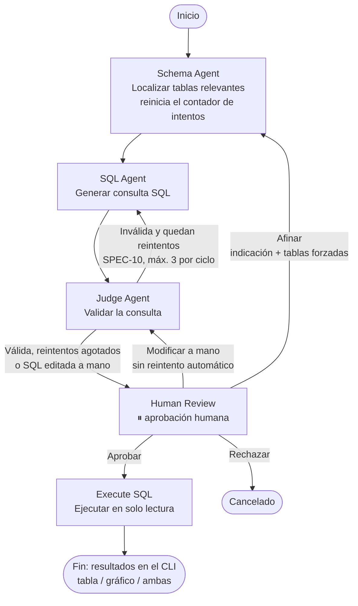
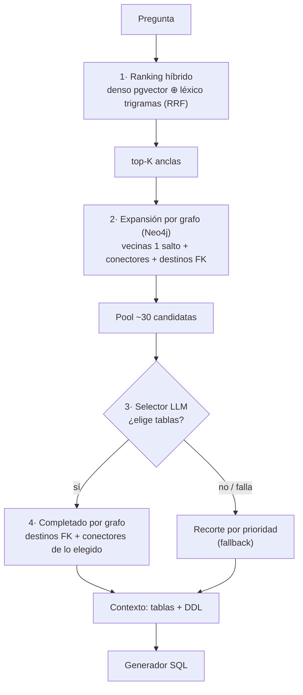

# GraphSQL — Diseño detallado y arquitectura

Este es el documento técnico: cómo está montado el sistema y **por qué** cada decisión. Para saber qué es GraphSQL o cómo usarlo, empieza por el [README](../../README.md); aquí voy al detalle del diseño. Los términos están en el [glosario](../glosario.md) y la especificación por componente en [SPEC.md](SPEC.md).

**Índice:**

1. [Motivación y problema](#1-motivación-y-problema)
2. [Visión de la solución](#2-visión-de-la-solución)
3. [Arquitectura técnica (grafo de estados)](#3-arquitectura-técnica-grafo-de-estados)
4. [Los agentes](#4-los-agentes)
5. [Grafo de conocimiento (Neo4j)](#5-grafo-de-conocimiento-neo4j)
6. [Memoria vectorial (PostgreSQL + pgvector)](#6-memoria-vectorial-postgresql--pgvector)
7. [Decisiones técnicas (D-xx)](#7-decisiones-técnicas)
8. [Seguridad](#8-seguridad)
9. [Estrategia de tests](#9-estrategia-de-tests)
10. [Evaluación experimental](#10-evaluación-experimental)
11. [Mejoras futuras](#11-mejoras-futuras)

## 1. Motivación y problema

Acceder a una base de datos relacional exige conocer SQL y el esquema exacto (tablas, columnas, relaciones), lo que crea una **brecha de acceso** entre los datos y quien los necesita. El problema se agrava en bases grandes (200+ tablas). Detalle del problema y objetivos en el [README](../../README.md).

## 2. Visión de la solución

Pipeline **multi-agente** orquestado con LangGraph: agentes especializados localizan las tablas relevantes, generan la SQL, la validan, piden aprobación humana y la ejecutan en solo lectura. La vista conceptual, con su diagrama, está en el [README](../../README.md); no la repito aquí y voy directo al **grafo real tal cual está implementado** (§3), que es lo que aporta este documento.

Todo está implementado salvo el **Memory Agent** (ejemplos *few-shot* de consultas pasadas), que queda como pieza futura (SPEC-09).

## 3. Arquitectura técnica (grafo de estados)

El pipeline de una consulta lo monto como una máquina de estados en LangGraph: cada paso es un agente y, según cómo queda el estado compartido (la pregunta, las tablas recuperadas, la SQL, lo que diga el Judge…), se decide el siguiente. El enrutado lo llevo con reglas, no con un LLM: el flujo es siempre el mismo, así que no necesito que un modelo decida por dónde seguir.

Este pipeline determinista lo monto como un **grafo propio**, distinto del grafo conversacional con *tools* de SPEC-01: aquí el flujo es fijo (recuperar → SQL ↔ Judge → revisión → ejecutar) y lo enruto con reglas sobre el estado, no con el modelo. El grafo conversacional se conserva en el código como base reutilizable (p. ej. para un futuro servidor MCP), pero **ya no se expone en el menú del CLI** (D-12): el pipeline cubre el caso de uso real y es el que formaliza el supervisor (SPEC-10). Ya tengo el esqueleto del grafo (SPEC-01), la ingesta/vectorización del esquema (SPEC-02/03), los agentes de recuperación, SQL y Judge (SPEC-04/05/06), la ejecución (SPEC-07), la revisión humana con su pausa (SPEC-08) y el supervisor con el reintento automático (SPEC-10); el estado de cada componente está en [SPEC.md](SPEC.md).

Este es el grafo **tal cual está implementado** (los nodos de `pipelineGraph.ts`, con sus aristas condicionales):


```mermaid
flowchart TD
    START([Inicio]) --> SA[Schema Agent\nLocalizar tablas relevantes\nreinicia el contador de intentos]
    SA --> SQL[SQL Agent\nGenerar consulta SQL]
    SQL --> JA[Judge Agent\nValidar la consulta]
    JA -->|Inválida y quedan reintentos\nSPEC-10, máx. 3 por ciclo| SQL
    JA -->|Válida, reintentos agotados\no SQL editada a mano| HR[Human Review\n⏸ aprobación humana]
    HR -->|Aprobar| EX[Execute SQL\nEjecutar en solo lectura]
    HR -->|Rechazar| END2([Cancelado])
    HR -->|Modificar a mano\nsin reintento automático| JA
    HR -->|Afinar\nindicación + tablas forzadas| SA
    EX --> END1([Fin: resultados en el CLI\ntabla / gráfico / ambas])
```

> El **Memory Agent** (buscar consultas pasadas como ejemplos *few-shot*) y el **Store Feedback**
> (guardar las aprobadas) son la pieza futura SPEC-09: no forman parte del grafo actual. La
> presentación de resultados (tabla o gráfico de barras, SPEC-19) es cosa del CLI, no un nodo.

Lo importante del flujo es la pausa para aprobar la SQL antes de ejecutarla, y ya está montada (SPEC-08). El nodo de revisión humana detiene el grafo (`interrupt_before`), **persiste el estado en PostgreSQL** (`graphsql_memory`, vía el `PostgresSaver` de LangGraph) y espera mi decisión. Como el estado queda guardado y es recuperable por `thread_id`, la pausa sobrevive al proceso.

Al reanudar, el grafo enruta según lo que elija: aprobar → ejecutar, rechazar → fin, modificar → vuelve al Judge con la SQL editada, y **afinar** → rehace la recuperación con mi indicación y las tablas forzadas (`mustInclude`).

Afinar (SPEC-15) es la vía guiada por el usuario. Doy una indicación en lenguaje natural ("añade la popularidad por wishlist") y/o fuerzo tablas, y el SQL Agent reescribe la consulta partiendo de la anterior. La indicación además se suma a la pregunta al recuperar, para que pueda aparecer una tabla nueva por significado. Y el Judge evalúa la consulta contra la pregunta más las indicaciones acumuladas: si solo viera la pregunta original, penalizaría justo lo que acabo de pedir. Las indicaciones y las tablas forzadas viven en el estado, así que se conservan y acumulan entre afinados; las tablas forzadas son **UX determinista**, porque el usuario controla el bucle, no el LLM.

Antes de llegar a la revisión, el supervisor (SPEC-10) mete su propio bucle automático Judge↔SQL. Si el Judge no da la consulta por buena —falla alguna comprobación determinista o su confianza queda por debajo de `MIN_CONFIDENCE`— y quedan intentos (`MAX_JUDGE_ATTEMPTS`), vuelvo sin más al SQL Agent con los errores del Judge para que los corrija, sin pasar por la revisión ni rehacer la recuperación. El contador se reinicia cada vez que entro en la recuperación (al empezar o al afinar), porque es un ciclo nuevo.

Si la SQL viene de una **modificación manual**, este reintento automático no se aplica nunca: el veredicto sobre una edición mía siempre vuelve a la revisión, gane o pierda, porque regenerarla a ciegas descartaría en silencio lo que acabo de escribir. Si se agotan los intentos sin superar el Judge, la consulta llega igual a la revisión, pero marcada como fracasada y sin opción de aprobar.

## 4. Los agentes

De estos, el **Schema Agent** (la recuperación GraphRAG), el **Judge** y el **Supervisor** ya están hechos; el **Memory Agent** queda pendiente (opcional). La idea de cada uno:

- **Supervisor** (hecho, SPEC-10). Decide el siguiente paso con reglas sobre el estado, sin LLM: forma el bucle automático Judge↔SQL (reintenta con los errores del Judge hasta `MAX_JUDGE_ATTEMPTS`, salvo que la SQL sea una modificación manual) y, cuando corresponde, enruta a Human Review y Execute.
- **Memory** (opcional). Busca consultas pasadas parecidas y se las pasa como ejemplos al SQL Agent. Es lo primero que recorto si voy justo de tiempo.
- **Schema** (el GraphRAG). Encuentra las tablas que hacen falta combinando la búsqueda por significado en pgvector (da con `customer` cuando escribo "clientes") y la expansión por claves foráneas en Neo4j para arrastrar las tablas relacionadas que necesitan los JOIN.
- **SQL.** Escribe la consulta a partir de la pregunta y de las tablas que le pasa el Schema Agent (y de los ejemplos del Memory Agent, si los hay). Su prompt vive en `agents/sql-generator.md` (editable sin tocar código); entre sus reglas, devolver la columna **legible** de cada entidad (title, name, username…) en vez de solo su id, que es lo que un usuario espera al preguntar por "los juegos" o "los clientes".
- **Judge.** Revisa que la SQL sea segura. Lo primero y obligatorio es comprobar que solo lee: debe empezar por `SELECT`/`WITH`, sin palabras peligrosas ni inyección, y si eso falla no se ejecuta diga lo que diga el resto. Por encima puede ir una comprobación de sintaxis y una revisión con el propio LLM. Esa revisión mide la confianza en si la consulta **responde a la pregunta con datos reales**, no solo si es sintácticamente correcta: una consulta que devuelve un texto literal en vez de datos puntúa bajo, y el supervisor la reintenta en lugar de darla por buena. Además (SPEC-14) juzga el **sentido**: por cada tabla usada evalúa si conoce su propósito —documentado por su descripción, evidente por nombre/columnas, o **supuesto** si el nombre es opaco y no hay descripción—. En ese último caso avisa de que la tabla se usa por suposición (aviso, no bloqueo). Para esto la descripción de cada tabla viaja ya en el contexto (DDL).
- **Human Review** (hecho, SPEC-08 + SPEC-15). Para el grafo antes de ejecutar y me enseña, en cajas con color, la SQL propuesta y el veredicto del Judge; espera a que la apruebe, la rechace, la modifique a mano o la **afine** (una indicación en lenguaje natural y/o forzar tablas, que rehace la recuperación y regenera la SQL). La pausa persiste en PostgreSQL, recuperable por `thread_id`.
- **Execute.** Ejecuta la consulta aprobada en solo lectura y devuelve los resultados.
- **Store Feedback** (futuro, SPEC-09, junto al Memory Agent). Guardaría la consulta aprobada para reutilizarla como ejemplo. Si fallara, no rompería nada (no es crítico).
- **Format** (no es un agente: es la capa de presentación del CLI). Pinta la SQL resaltada, el veredicto del Judge en cajas y los resultados como tabla o gráfico de barras (SPEC-19); los agentes devuelven datos y la presentación es cosa aparte.

**Los prompts de sistema viven en `agents/*.md`, no en el código.** Cada agente con prompt propio tiene su fichero en la carpeta `agents/` de la raíz (`sql-generator.md`, `judge.md`, `equivalence-judge.md`, `chat.md`), con placeholders tipo `{{dialect}}` que se sustituyen al cargar (`agentPrompts.ts`). Así puedo ajustar el comportamiento de un agente —afinar un criterio del juez, endurecer una regla del generador— editando un Markdown, sin tocar TypeScript ni recompilar. Y el prompt exacto de cada agente queda versionado y legible como documentación. El juez de equivalencia de la evaluación, además de las dos SQL, recibe el **resultado ejecutado** de ambas (una muestra de filas), para anclar su veredicto en evidencia real en lugar de especular sobre divergencias hipotéticas.

## 5. Grafo de conocimiento (Neo4j)

Modelo el esquema relacional de la BD objetivo como un grafo en Neo4j, porque un esquema *es* un grafo: tablas unidas por claves foráneas. Tenerlo así me deja, dada una tabla candidata, expandir a las relacionadas siguiendo las FKs (lo que necesito para los JOINs).

**Modelo de datos (lo ya implementado):**

```
(:Table)-[:HAS_COLUMN]->(:Column)
(:Table)-[:REFERENCES {from_column, to_column}]->(:Table)   // una por cada clave foránea
```

- `Table`: `name`, `full_name`, `schema`, `description` (opcional), `primary_keys`, `column_count`.
- `Column`: `name`, `type`, `nullable`, `is_primary_key`, `table_name`.
- `REFERENCES`: relación dirigida de la tabla con la FK hacia la tabla referenciada, guardando las columnas origen/destino.

**Ingesta.** Leo el esquema de la BD objetivo (vía `information_schema` en PostgreSQL) y lo vuelco en dos pasadas: primero todos los nodos `Table` con sus `Column`, y después las relaciones `REFERENCES` (cuando ya existen todas las tablas). Antes de reimportar limpio el grafo, y aseguro `Table.name` único con un constraint. El escaneo se dispara desde el CLI o como *tool* del agente.

Sobre este grafo se apoya la recuperación: la búsqueda vectorial (pgvector) encuentra las tablas candidatas y la expansión por FKs en el grafo trae las relacionadas. La capa de descripciones/conceptos enriquece ambos.

## 6. Memoria vectorial (PostgreSQL + pgvector)

Uso PostgreSQL + pgvector (en la base `graphsql_memory`) para la búsqueda semántica de tablas: encontrar `customer` cuando el usuario dice "clientes", o casar una pregunta en español con un esquema en inglés. Reutilizo la instancia que ya necesito para los checkpoints de LangGraph, así que es una pieza de infraestructura, no dos.

**Vectorización del esquema (lo ya implementado).** Al escanear, por cada tabla compongo un texto (`Tabla: <nombre>. Columnas: <...>`, más la descripción si la hay), lo embebo y lo guardo en `table_embeddings`: el texto de búsqueda, el `embedding vector(N)`, el proveedor, el modelo y la dimensión usados, y la descripción cruda en su propia columna. Guardar el proveedor/modelo/dimensión deja el índice autodescrito, para que el retriever consulte con el mismo modelo. La tabla se reconstruye entera en cada vectorización.

**El escaneo es atómico (Neo4j + pgvector juntos).** Un escaneo reconstruye los dos almacenes con la **misma** decisión de descripciones, para que nunca se desincronicen: la ingesta a Neo4j (estructura + `Table.description`) y la vectorización a pgvector (el vector, con la descripción **embebida** en el texto de búsqueda) van en el mismo paso. Para iterar descripciones sin pagar el esquema entero existe además la **actualización incremental** (SPEC-29): compara el JSON con la descripción guardada junto a cada vector, re-embebe solo las tablas afectadas y actualiza los dos almacenes en el mismo paso; sin cambios, cero llamadas al proveedor. La descripción tiene que estar en pgvector porque la búsqueda semántica solo mira el vector; en Neo4j sirve para la estructura y para mostrarla. La confirmación con el aviso de coste gatea el escaneo completo: si la declino, no se toca nada. Un fallo de la vectorización *después* de actualizar Neo4j se avisa como desincronización, a reparar reescaneando; no monto un commit en dos fases entre Neo4j y Postgres, que se sale del alcance.

**Proveedor de embeddings configurable.** Detrás del puerto `IEmbeddings` hay un adaptador OpenAI-compatible que sirve para OpenAI (`text-embedding-3-small`, 1536) y para un modelo local en LM Studio (`bge-m3`); el proveedor se elige al escanear, igual que el del chat.

**Principio innegociable.** Indexo y consulto con el **mismo modelo**: la similitud solo tiene sentido dentro del mismo espacio vectorial. Por eso guardo el modelo y la dimensión con cada vector, la dimensión de la columna es configurable, y cambiar de modelo obliga a una re-vectorización explícita (con aviso). Detalle en [`docs/proceso/investigacion/embeddings.md`](../proceso/investigacion/embeddings.md).

**Recuperación (SPEC-04, hecho).** Dada una pregunta, busco las tablas candidatas por significado en pgvector y las expando por claves foráneas en Neo4j para componer el contexto (tablas relevantes + DDL) que usará el SQL Agent. A esta escala uso búsqueda exacta por coseno, sin índice ANN.

**Explicabilidad de la recuperación (SPEC-13, hecho).** El contexto final oculta *por qué* entró cada tabla, así que expongo una **traza** del circuito. Muestra el ranking semántico con el score de cada tabla (marcando las candidatas top-K), las tablas que se añaden por expansión de FK con su score —normalmente bajo, que es lo que delata que las trajo el grafo y no el vector—, y el contexto final con el **motivo** de cada tabla (semántica / expansión / conector / destino FK / elegida por el LLM / fijada). No altera la recuperación, comparte el mismo circuito que el pipeline: solo la explica. Sirve para no dar por buena a ciegas una recuperación que parece semántica, y como base cualitativa del *ablation* (SPEC-11). Se ve desde el CLI en el modo depuración, que además imprime el DDL exacto que recibe el generador: si una columna no está ahí y aparece en la consulta, el modelo se la inventó.

**Recuperación por capas para esquemas grandes (SPEC-26, hecho).** La recuperación de SPEC-04 (top-K vectorial + expansión por FK) funciona en Arcadia/Nebula, pero al probarla contra un ERP real de ~800 tablas con nombres opacos y sin descripciones se rompe. El caso que lo destapó:

> «¿Qué **abonado** tiene más líneas de **fibra**?»

La frase habla sobre todo de fibra, así que su embedding queda cerca de las decenas de tablas `fib_*` del ERP, y `abonats` —la entidad por la que se pregunta, el sujeto de la frase— cae al puesto ~179 del ranking. Con un top-K de 5 no entra, y subir el K no lo arregla: un top-30 trae 30 tablas de fibra, no `abonats`. Este patrón tiene nombre (*entity-pivot*) y una lección de fondo: **la similitud mide el *tema* de una tabla, no su *papel*** en la pregunta.

Para sostener esa escala añadí cuatro capas: dos de *recall* (que el pivote aparezca entre las candidatas) y dos de *precisión* (que el contexto final sea el bueno). Todas van **detrás de palancas** (`SchemaRetrievalOptions`) que el pipeline en vivo activa y el *ablation* del golden set deja apagadas, así las métricas de §10 siguen midiendo SPEC-04 puro y son comparables.

1. **Ranking léxico por trigramas (recall por palabras).** El denso compara *significados*; el léxico compara *letras*. Si la pregunta dice "abonado" y existe una tabla `abonats`, esa es una señal que ningún embedding debería poder enterrar. Tokenizo la pregunta (minúsculas, sin acentos, sin palabras vacías) y comparo cada palabra con el nombre y las columnas de cada tabla, troceando ambas en **trigramas** (ventanas de 3 letras) y midiendo la similitud de Jaccard (comunes / totales). El troceo es lo que da tolerancia a variaciones: "facturacio" y "factures" comparten 6 trigramas de 14 (`fac`, `act`, `ctu`, `tur`…) → 0.43, suficiente para casar aunque ninguna contenga a la otra. El léxico es el complemento exacto del denso: infalible cuando las palabras coinciden, ciego ante sinónimos ("suscriptor" no casa con `abonats`, eso lo cubre el denso). Por eso no sustituyo uno por otro: los fusiono.
2. **Fusión por *Reciprocal Rank Fusion* (RRF).** Los scores del denso (coseno, 0–1) y del léxico (sumas arbitrarias) no son comparables, y no quiero inventar y calibrar pesos por BD. El RRF ignora los scores y mira solo las **posiciones**: cada tabla suma `1/(60 + posición)` por cada ranking donde aparece. Con los números del caso real: `fib_centrals`, 1ª en el denso y ausente en el léxico, suma 1/61 = 0.0164; `abonats`, 179ª en el denso pero 1ª en el léxico, suma 1/239 + 1/61 = **0.0206 y la adelanta**. Ser muy buena en *cualquiera* de las dos listas te sube; buena en *ambas*, más, y sin ningún hiperparámetro que calibrar. El ranking fusionado manda en todo lo que sigue: de él salen las candidatas top-K, las "anclas".
3. **Expansión por grafo (recall por estructura).** Aquí cambio de fuente de señal: ya no miro el texto sino las **FK reales** en Neo4j. Aunque una tabla no se parezca en nada a la pregunta, si la estructura dice que es imprescindible para el JOIN, hay que traerla. Hago dos rescates. El primero son los **destinos de FK** de las anclas: si `abo_linies.id_abonat` referencia a `abonats`, ahí vive literalmente la respuesta de "qué abonado", así que esa tabla queda protegida del recorte aunque su score sea ínfimo. El segundo son los **conectores**: las tablas intermedias en el camino de FK más corto entre dos anclas. Si el grafo dice `dades_fiscals → abonats → abo_linies`, `abonats` es el puente sin el que el JOIN entre las otras dos no se puede escribir (el caso típico es un hub central o una tabla de unión, justo las que nunca se parecen a ninguna pregunta). Para que esto no infle el contexto, nada está "exento del límite": todo compite por el mismo presupuesto (`maxTables`) con prioridad estricta —fijadas > top-K > conectores > destinos FK > resto— y, dentro de cada nivel, por score. El rescate estructural nunca expulsa a las candidatas semánticas.
4. **Selección con LLM (precisión por razonamiento) + completado por grafo.** Las capas anteriores dan *recall*: garantizan que `abonats` está **entre** las ~30 candidatas del pool. Pero el contexto del generador debe ser pequeño, y recortar por score vuelve a ser un concurso de parecido, el mismo sesgo de siempre. Así que un LLM (el modelo de rol *razonamiento*) lee la pregunta y el catálogo del pool y **elige** las tablas necesarias. Distingue lo que la similitud no puede: entre 12 tablas `fib_*` igual de "parecidas", sabe que para esta pregunta hace falta una y no las otras once, y que `abonats` es imprescindible aunque la frase vaya de fibra (el prompt le advierte explícitamente del sesgo *entity-pivot*). Lleva tres barandillas: no puede **inventar** (su respuesta se filtra contra el pool), no puede **bloquear** (si no elige nada válido o falla —excepción incluida— se cae al recorte por score: es una mejora, nunca un punto único de fallo) y no puede **desfijar** (las tablas fijadas de SPEC-08 se unen siempre a su selección). Por último, lo que elige se **completa por grafo** con sus destinos de FK y conectores, porque su selección puede no ser *ejecutable*: si elige `abonats` pero la razón social vive en `dades_fiscals` (destino de FK de `abonats`), sin ese completado la SQL no se puede escribir.


```mermaid
flowchart TD
  Q[Pregunta] --> H["1· Ranking híbrido<br/>denso pgvector ⊕ léxico trigramas (RRF)"]
  H --> A[top-K anclas]
  A --> G["2· Expansión por grafo (Neo4j)<br/>vecinas 1 salto + conectores + destinos FK"]
  G --> P["Pool ~30 candidatas"]
  P --> S{"3· Selector LLM<br/>¿elige tablas?"}
  S -- sí --> C["4· Completado por grafo<br/>destinos FK + conectores de lo elegido"]
  S -- no / falla --> R["Recorte por prioridad<br/>(fallback)"]
  C --> CTX[Contexto: tablas + DDL]
  R --> CTX
  CTX --> GEN[Generador SQL]
```

Todos los términos del diagrama (ancla, tabla vecina, conector, destino de FK, pool, selector, recorte por prioridad) están definidos en lenguaje llano en el [glosario](../glosario.md), pensados para quien llega sin contexto.

Con el ejemplo completo: el **léxico** rescata `abonats` del puesto 179 porque "abonado" casa con su nombre; el **RRF** la sube al top-K sin calibrar ningún peso; el **grafo** trae `dades_fiscals` (destino de FK, ahí vive la razón social) y los puentes entre anclas; y el **selector** se queda con las 4-5 tablas justas y descarta las once `fib_*` que sobraban. Cada capa en una frase: el léxico garantiza que las palabras de la pregunta pesan, el RRF fusiona sin hiperparámetros, el grafo trae lo que la estructura exige aunque no se parezca a nada, y el selector pone el razonamiento que la similitud no tiene. Todo esto se ve en vivo en el modo depuración (SPEC-13), fase por fase y con el motivo de cada tabla.

**Doble modelo por rol.** Uso dos modelos por proveedor: uno de **razonamiento** (el selector, que piensa qué tablas) y uno de **generación** (el que escribe la SELECT, más el juez y la equivalencia, tareas centradas en SQL). Cada rol tiene su variable de entorno y cae al modelo base si no está puesta, así que "pueden ser el mismo" sin configurar nada. En local esto permite, p. ej., un modelo pequeño razonando y el *coder* escribiendo la SQL.

**Lo que esto NO resuelve.** Con esquemas grandes sin documentar, el techo sigue siendo la calidad del ranking, y esa la fija la **descripción de tabla**: medido sobre el ERP real, describir una tabla la sube del puesto ~60 al top del ranking. El grafo la puede rescatar aunque no rankee, pero el camino robusto es documentar el esquema — y describir cientos de tablas a mano no es viable, de ahí el generador automático de descripciones (SPEC-27, hecho): un LLM redacta una frase por tabla desde sus columnas, sus claves y una muestra opcional de filas, y la deja donde el escaneo ya la recoge. El particionado por dominios/clusters queda como segundo nivel de afinado para escala.

## 7. Decisiones técnicas

**TypeScript (Node.js 20+).** Tengo más soltura con el lenguaje y `@langchain/langgraph`, `neo4j-driver` y `@langchain/openai` cubren todo lo que necesito; la toolchain de Node me simplifica el entorno de desarrollo en Windows.

**LangGraph (orquestación).** Mi flujo es una máquina de estados determinista con un bucle de reintento y una pausa para aprobación humana. LangGraph lo modela de forma nativa: routing por reglas sobre el estado (sin LLM supervisor), *checkpointers* para persistir el estado e `interrupt_before` para el *human-in-the-loop*. Frente a un agente ReAct (indeterminista, una llamada LLM por decisión de routing), es más predecible, auditable y barato. **Descarto ReAct.**

**Neo4j (grafo de conocimiento del esquema).** El esquema relacional es intrínsecamente un grafo (tablas unidas por claves foráneas). Modelarlo en Neo4j me permite expandir desde una tabla candidata a las relacionadas siguiendo las FKs (necesario para los JOINs) y añadir nodos de descripción/concepto para el caso multilingüe (`pedido` ↔ `order`). **Lo combino con pgvector**: vector para encontrar tablas candidatas, grafo para expandir por relaciones.

**PostgreSQL + pgvector, no Qdrant (memoria vectorial).** Ya necesito PostgreSQL para los *checkpoints* de LangGraph; pgvector reutiliza esa misma instancia → una pieza de infraestructura en lugar de dos. A la escala de mi proyecto, no aprovecharía las ventajas de Qdrant.

**CLI en terminal, no web (interfaz).** Lo que quiero estudiar son los agentes, no la capa de presentación; el patrón pregunta → aprobación → ejecución encaja con un REPL de terminal y me reduce la infraestructura. La monto con `@inquirer/prompts` (menús y captura de texto), `boxen` (cabecera) y `chalk` (color). El arranque incluye un *preflight* de infraestructura (SPEC-28): `npm start` comprueba Docker y los contenedores y, si faltan, guía al usuario para levantarlos — el CLI es también el instalador de su propia infraestructura. Puedo desacoplar la lógica de la presentación, así que dejo una web como mejora futura.

**Supervisor determinista, no LLM (routing).** El flujo sigue una secuencia fija; un LLM supervisor añadiría llamadas por cada decisión de routing para llegar a la misma conclusión. Reglas sobre el estado → más barato, predecible y auditable.

**Observabilidad en desarrollo: LangSmith, opcional y apagada por defecto.** En las primeras fases usé LangSmith (el trazado de la suite LangChain, en su capa gratuita) para depurar los grafos: cada ejecución queda como un árbol con las entradas y salidas de cada nodo y de cada llamada LLM. Se activa solo con variables de entorno (`LANGSMITH_TRACING`) y no hace falta para usar GraphSQL. La desactivé en cuanto el proyecto empezó a tocar esquemas reales: es un servicio en la nube, y mandar allí preguntas y DDL contradiría el on-premise (D-14). Para observabilidad permanente dentro del perímetro está especificada SPEC-30: **Arize Phoenix** auto-alojado (un solo contenedor, estándar OpenTelemetry), detrás de un *profile* de compose y apagado por defecto; Langfuse queda como alternativa más completa pero más pesada de operar (~6 servicios).

**Organización del código: capas hacia dentro, funcionalidad hacia los lados.** `graphsql/` sigue clean architecture: `domain` (tipos y reglas puras) ← `application` (casos de uso) ← `infrastructure` (adaptadores) y `orchestration`. La orquestación (LangGraph) vive en el anillo exterior junto al CLI a propósito: ningún caso de uso importa LangGraph, así que la lógica se prueba con dobles sin framework (D-05). Tampoco envuelvo LangGraph en un puerto: lo elegí precisamente por sus primitivas nativas (checkpointer, `interrupt_before`), y abstraerlas sería pagar una indirección para no usar lo que lo hace valioso. Dentro de cada capa agrupo **por funcionalidad** (`application/{scan,retrieval,sql,evaluation}`), para que el árbol cuente la historia del sistema. El recorrido completo por la estructura, con ejemplos, está en [`docs/estructura.md`](../estructura.md).

**Despliegue on-premise, no en nube pública (D-14).** GraphSQL maneja el esquema y los datos de la base de datos corporativa, y en mi entorno laboral —que es la organización destinataria— eso corre en servidores propios con Kubernetes y Docker, no en una nube de terceros. Así que el despliegue objetivo es dentro del perímetro (para eso existe también el proveedor LLM local), y no monto una instancia en un VPS público: demostraría el sistema fuera del entorno al que va dirigido, sin aportar nada a la entrega. La entrega es una instalación reproducible y documentada (`docker compose up -d` + [guía de instalación](../instalacion.md), datos deterministas por seed); como todo está ya en contenedores, ese mismo compose es la base directa de un despliegue en Kubernetes sobre servidores propios, que dejo como mejora futura.

**Distribución: comando global npm + imagen Docker de demo, no ejecutable standalone ni registro público (D-16).** Una vez decidido el on-premise (D-14), quedaba cómo se *instala* GraphSQL en una máquina. Lo resuelvo con dos canales que cubren dos públicos distintos (SPEC-31).

Para quien trabaja con el proyecto, el campo `bin` de npm registra el comando **`gsql`**. `npm link` desde `backend/` lo deja en la carpeta global de npm (en Windows, `%APPDATA%\npm`) y el CLI se invoca desde cualquier carpeta; para eso todas las rutas a recursos (`agents/`, `descriptions/`, `.env`, el compose) se resuelven desde el código, no desde el directorio de ejecución. Ese canal se entrega con un **instalador bootstrap de un comando** (SPEC-32): `install.ps1` / `install.sh` en el propio repo, el patrón de nvm o rustup, legible en cien líneas. Comprueba requisitos, pregunta el directorio, clona (o actualiza), configura el `.env` y registra `gsql`; la infraestructura no la monta él, la monta el propio CLI al arrancar (SPEC-28).

Para quien solo quiere *evaluar* la demo sin instalar Node, hay una **imagen Docker del CLI** (`Dockerfile` + servicio `cli` bajo el profile `demo` del compose): `docker compose --profile demo run --rm cli` levanta la demo entera solo con Docker. Descarté un ejecutable standalone (pkg / SEA de Node): empaquetaría el binario pero no resolvería nada real, porque la aplicación necesita el repo al lado igualmente (compose, scripts de init, prompts editables como texto; que los prompts sean ficheros y no recursos embebidos es una feature, no un descuido).

Las imágenes están **publicadas en Docker Hub** (`pclota/graphsql-cli` y `pclota/graphsql-postgres-demo`, esta última con las bases de prueba y su init horneados), así que la demo se instala **sin clonar el repo**: descargar `docker-compose.hub.yml` y un `docker compose run cli` (SPEC-33). El único cuidado real está en qué entra en cada artefacto: la imagen del CLI copia solo los `*.example.json` de `descriptions/` (la carpeta va excluida entera en `.dockerignore`), porque las descripciones de una BD real son esquema confidencial de empresa y no deben entrar jamás en algo distribuible.

**Zod como validador en las fronteras, no solo para formularios (D-17).** Ya usaba Zod para el `.env` y el fichero de descripciones, y lo extendí a las otras dos fronteras donde entran datos que no controlo: las respuestas JSON del LLM (el Judge, el juez de equivalencia) y las filas que devuelven Neo4j y Postgres. Antes cada sitio reinventaba la misma tolerancia con funciones sueltas; un esquema declarativo con `.catch()` dice lo mismo en menos código (un campo mal formado cae a un valor neutro en vez de tumbar el veredicto entero), y de paso deja un catálogo único de las variables de entorno en `env.ts`. No lo meto en los tipos internos del dominio: ahí ya vigila TypeScript en tiempo de compilación.

**Tercer proveedor: el gateway LLM corporativo (D-18).** Hasta ahora tenía dos extremos: OpenAI en la nube, cómodo y con coste, y LM Studio en mi máquina, gratis y offline pero limitado a lo que cabe en un portátil. En una organización el punto intermedio es el que manda: un servidor propio —LiteLLM y compatibles— que habla la API de OpenAI y decide él qué modelo hay detrás, sea uno alojado en sus GPUs o la propia OpenAI con la clave de la empresa. Añado ese caso como proveedor `gateway`, con sus variables y su opción en el menú de arranque, en vez de reaprovechar la rama local apuntando la URL a otro sitio: el nombre importa porque el CLI lo enseña antes de cada sesión, y la traza de embeddings guarda con qué proveedor se indexó.

Encaja con el on-premise (D-14) sin contradecirlo: las preguntas y el esquema no salen del perímetro, y quién responde detrás es una decisión de la organización, no del cliente. De paso concentra en un solo sitio lo que en gobernanza se pide por separado —la clave, la cuota por equipo y la traza de las llamadas—, que es justo lo que no puede dar el modo local. Dos detalles que sí me obligaron a escribir código en vez de configuración: el gateway publica **alias** de modelo propios (así que el aviso de "ese modelo no existe" tiene que consultar su `/models`, y con la clave, porque sin ella responde 401), y el recorte de dimensión de embeddings solo vale si detrás hay un `text-embedding-3`, de modo que pedirlo es una decisión explícita (`GATEWAY_EMBEDDING_SEND_DIMENSIONS`) y no un supuesto.

## 8. Seguridad

La seguridad es lo que no me quiero saltar. De todo esto ya están montadas y probadas varias cosas. La **sesión de solo lectura**: el adaptador de Postgres abre la conexión en modo `READ ONLY`, así que un INSERT falla aunque me equivoque. Y el **Judge** (SPEC-06) con sus capas: la **Capa 1**, un validador puro que rechaza cualquier sentencia que no sea claramente de solo lectura (debe empezar por `SELECT`/`WITH`, sin palabras de escritura ni patrones de inyección); la **Capa 2**, un `EXPLAIN` contra la BD que comprueba la sintaxis real sin ejecutar; y la **Capa 3**, un juez LLM que aporta confianza y avisos pero que no bloquea por sí solo (puede ser demasiado estricto). Quien bloquea son las capas deterministas (1 y 2). El **ejecutor** (SPEC-07) ya está: ejecuta en solo lectura, vuelve a pasar la comprobación de seguridad como última barrera (lanza `UnsafeQueryError` si algo no fuera de solo lectura) y limita filas y tiempo. Y la **aprobación humana** (SPEC-08) ya se interpone antes de ese ejecutor: el grafo se para en la revisión (`interrupt_before`) y nada se ejecuta sin mi visto bueno. Una consulta que no supere el Judge llega igualmente a la revisión, pero marcada como fracasada y sin opción de aprobar.

Lo que quiero garantizar:

- **Solo lectura**: rechazo cualquier consulta que no empiece por `SELECT`/`WITH`.
- **Nada de operaciones peligrosas ni inyección**: detecto palabras como `DROP`, `DELETE`, `INSERT`, `UPDATE`… y patrones tipo `;`, `--` o `/* */`.
- **Aprobación humana**: nada se ejecuta sin que yo dé el visto bueno.
- **Usuario sin permisos de escritura** en la BD objetivo: la última defensa está en el motor, no en mi código (esto ya está).
- **Secretos solo en el `.env`**: nunca en el código ni en los logs.
- **No registro** consultas con datos sensibles.

Antes de entregar repaso que cada punto tenga al menos un test que lo compruebe.

## 9. Estrategia de tests

Separo los tests en tres suites según qué necesitan para correr, apoyándome en el mismo patrón puerto/adaptador/factory que uso en toda la infraestructura (D-05): los casos de uso reciben sus colaboradores inyectados (`XxxDependencies` + `defaultXxxDependencies` + un `deps` opcional), así que en los tests les puedo pasar un doble en memoria sin tocar Docker.

- **`tests/unit/` (`npm test`).** Los que corren siempre, offline y en milisegundos. Inyecto dobles en vez de la BD objetivo, el LLM, Neo4j o pgvector, y pruebo la lógica de orquestación de cada caso de uso: sus ramas, la gestión de errores, los límites (p. ej. acotar la confianza del Judge a `[0,1]`, o que una tabla fijada a mano sobrevive al recorte final de la recuperación). No dependen de `docker compose up`, así que son los únicos que exijo en verde antes de dar un SPEC por cerrado.

- **`tests/integration/` (`npm run test:integration`, opt-in).** Los mismos casos de uso, pero con su implementación real por defecto: hablan de verdad con Postgres, Neo4j, pgvector o el LLM configurado. Los reservo para lo que un doble no puede demostrar: que el cursor de Postgres corta de verdad en el límite de filas, que la búsqueda semántica real traduce "clientes" a `customer`, que el `PostgresSaver` persiste el estado del pipeline entre procesos y es recuperable por `thread_id`. Son opt-in porque necesitan `docker compose up -d` y tardan más; los corro antes de cerrar un SPEC que toque infraestructura real.

- **`tests/diagnostic/` (`npm run test:diagnostic`, opt-in).** No prueban comportamiento de la aplicación: comprueban que el *entorno* está bien montado — el servidor Postgres/Neo4j responde, las bases de datos y la extensión pgvector existen, el dataset Arcadia tiene las tablas y los volúmenes esperados, el esquema se lee e ingiere bien en Neo4j. Los uso para descartar rápido "¿es un bug o es que no tengo Docker levantado / el seed está mal?" antes de ponerme a depurar código.

Evito a propósito la redundancia entre suites: si un test de integración solo repite una rama lógica que el unitario ya cubre con un doble (misma entrada, misma aserción, sin ejercer nada propio de la infraestructura real), lo quito — añade el coste de Docker sin añadir señal nueva. Unitario e integración conviven cuando cada uno demuestra algo que el otro no puede.

## 10. Evaluación experimental

Quiero poder enseñar que el GraphRAG sirve de algo, no solo decirlo, y para eso el banco de pruebas es una decisión de diseño en sí misma. **No evalúo sobre los esquemas públicos de siempre** (Northwind, Chinook…): los modelos ya los vieron al entrenarse, así que un acierto no distinguiría si es porque mi sistema les da el contexto bueno o porque se lo saben de memoria. Por eso monté mis propias bases sintéticas: **Arcadia** (17 tablas) y **Nebula** (66 tablas, misma familia de dominio), con nombres en inglés, preguntas en español y algún nombre poco evidente, para que el sistema tenga que buscar las tablas de verdad. Los datos son deterministas por seed y ninguna tabla lleva datos reales.

Sobre ellas corre el arnés (SPEC-11, `npm run evaluate`): lanza un golden set de preguntas con su SQL de referencia en **tres modos** de recuperación —sin recuperación (el esquema entero en el contexto), solo búsqueda vectorial, y GraphRAG completo (vectorial + expansión por FK)— y mide, por caso y modo, el *schema-linking recall*, el *tamaño de contexto* y la *execution accuracy* (comparando resultados ejecutados, no el texto de la SQL), con un juez LLM de equivalencia semántica al lado.

**La conclusión, en una frase:** el GraphRAG **iguala** la precisión de meter el esquema entero **gastando una fracción del contexto** (~7,6× menos a 66 tablas), mientras la búsqueda vectorial sola —con un contexto igual de barato— se hunde al escalar porque se deja las tablas de JOIN que la expansión por el grafo recupera; y las **descripciones** de tabla son el techo de calidad cuando el esquema es opaco. La ventaja del GraphRAG no es "acierta más" a esta escala amable, sino "la misma calidad por una fracción del coste", y se abre con el tamaño y la opacidad del esquema.

**El detalle vive en [`docs/evaluacion/`](../evaluacion/)**, no aquí, para que la arquitectura no cargue con resultados que cambian a cada tirada: las tablas completas (medias de 5 tiradas, las dos BDs) en [`resumen.md`](../evaluacion/resumen.md) y [`escala-tiradas.md`](../evaluacion/escala-tiradas.md), el aporte de las descripciones en [`descripciones.md`](../evaluacion/descripciones.md), el experimento de confusión con esquemas opacos en [`confusion.md`](../evaluacion/confusion.md), la verificación 100% local en [`escala-coder14b.md`](../evaluacion/escala-coder14b.md), y —importante para leer los números con cabeza— los **[sesgos y límites de las métricas](../evaluacion/sesgos.md)** y la **[auditoría 2026-07-09](../evaluacion/auditoria-2026-07-09.md)** que corrigió el arnés y la ground truth. Empieza por el [README de esa carpeta](../evaluacion/README.md), que explica cómo leer cada tabla.

## 11. Mejoras futuras

Líneas abiertas más allá del MVP (visión, no alcance entregable):

- **Aprendizaje continuo evaluado**: que el sistema evalúe la calidad de sus respuestas y mejore con el uso.
- **Relaciones sintéticas en el grafo (SPEC-22)**: aristas curadas a mano para BDs que **no declaran FKs** (un ERP viejo, una BD de un tercero que no puedo tocar). Las declaro en un sidecar, viven solo en Neo4j sin modificar la BD objetivo, y la expansión por FK y el SQL Agent las usan como si fueran reales. Es lo que hace viable el GraphRAG sobre esquemas legacy sin relaciones declaradas — el mismo patrón de metadata curada que las descripciones, aplicado a las relaciones.
- **Explotación BI / visualización**: detectar resultados "graficables" y generar gráficos o paneles → *análisis conversacional* ("muéstrame las ventas por mes" devuelve un gráfico).
- Interfaz web.
- **Índice ANN para esquemas muy grandes (miles de tablas).** Hoy la búsqueda de candidatas es *exacta*: comparo la pregunta contra el vector de cada tabla. Es coste lineal, pero a la escala de un esquema —decenas o cientos de tablas— es instantáneo (manda la llamada de embedding, no el número de tablas). Si algún día apuntara a catálogos de **miles** de tablas entraría un índice **ANN** (*Approximate Nearest Neighbor*): busca solo entre un subconjunto de candidatos probables (~O(log N)) a cambio de poder saltarse algún vecino cercano de vez en cuando — un poco de recall por mucha velocidad, que solo compensa con N grande. Usaría **`hnsw`**, no el `ivfflat` que quité: no necesita entrenamiento ni afinar `lists`/`probes` y funciona bien aunque haya pocas filas.
