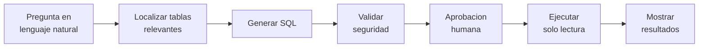
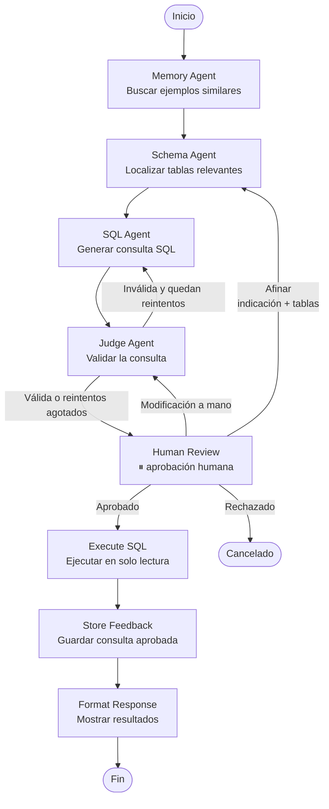

# GraphSQL — Diseño detallado y arquitectura

## 1. Motivación y problema

Acceder a una base de datos relacional exige conocer SQL y el esquema exacto (tablas, columnas, relaciones), lo que crea una **brecha de acceso** entre los datos y quien los necesita. El problema se agrava en bases grandes (200+ tablas). Detalle del problema y objetivos en el [README](../../README.md).

## 2. Visión de la solución

Pipeline **multi-agente** orquestado con LangGraph: agentes especializados localizan las tablas relevantes, generan la SQL, la validan, piden aprobación humana y la ejecutan en solo lectura.

```
┌─────────────────────────────────────────────────────────────┐
│                          Usuario                            │
│   "Muéstrame las 10 categorías con más ventas este año"     │
└─────────────────────────┬───────────────────────────────────┘
                          │ Lenguaje natural
                          ▼
┌─────────────────────────────────────────────────────────────┐
│                        GraphSQL                             │
│   ┌──────────┐  ┌──────────┐  ┌──────────┐  ┌──────────┐    │
│   │ Memory   │→ │ Schema   │→ │   SQL    │→ │  Judge   │    │
│   │  Agent   │  │  Agent   │  │  Agent   │  │  Agent   │    │
│   └──────────┘  └──────────┘  └──────────┘  └──────────┘    │
│                                     │                        │
│                                     ▼                        │
│         Aprobación humana → Ejecución segura → Resultados    │
└─────────────────────────────────────────────────────────────┘
```


```mermaid
flowchart LR
    U[Pregunta en<br/>lenguaje natural] --> S[Localizar tablas<br/>relevantes]
    S --> G[Generar SQL]
    G --> V[Validar<br/>seguridad]
    V --> H[Aprobacion<br/>humana]
    H --> E[Ejecutar<br/>solo lectura]
    E --> R[Mostrar<br/>resultados]
```

## 3. Arquitectura técnica (grafo de estados)

El pipeline de una consulta lo monto como una máquina de estados en LangGraph: cada paso es un agente y, según cómo queda el estado compartido (la pregunta, las tablas recuperadas, la SQL, lo que diga el Judge…), se decide el siguiente. El enrutado lo llevo con reglas, no con un LLM: el flujo es siempre el mismo, así que no necesito que un modelo decida por dónde seguir.

Este pipeline determinista lo monto como un **grafo propio**, distinto del grafo conversacional con *tools* de SPEC-01: aquí el flujo es fijo (recuperar → SQL ↔ Judge → revisión → ejecutar) y lo enruto con reglas sobre el estado, no con el modelo. El grafo conversacional se conserva en el código como base reutilizable (p. ej. para un futuro servidor MCP), pero **ya no se expone en el menú del CLI** (D-12): el pipeline cubre el caso de uso real y es el que formaliza el supervisor (SPEC-10). Ya tengo el esqueleto del grafo (SPEC-01), la ingesta/vectorización del esquema (SPEC-02/03), los agentes de recuperación, SQL y Judge (SPEC-04/05/06), la ejecución (SPEC-07), la revisión humana con su pausa (SPEC-08) y el supervisor con el reintento automático (SPEC-10); el estado de cada componente está en [SPEC.md](SPEC.md).


```mermaid
flowchart TD
    START([Inicio]) --> MA[Memory Agent\nBuscar ejemplos similares]
    MA --> SA[Schema Agent\nLocalizar tablas relevantes]
    SA --> SQL[SQL Agent\nGenerar consulta SQL]
    SQL --> JA[Judge Agent\nValidar la consulta]
    JA -->|Inválida y quedan reintentos| SQL
    JA -->|Válida o reintentos agotados| HR[Human Review\n⏸ aprobación humana]
    HR -->|Aprobado| EX[Execute SQL\nEjecutar en solo lectura]
    HR -->|Rechazado| END2([Cancelado])
    HR -->|Modificación a mano| JA
    HR -->|Afinar\nindicación + tablas| SA
    EX --> SF[Store Feedback\nGuardar consulta aprobada]
    SF --> FR[Format Response\nMostrar resultados]
    FR --> END1([Fin])
```

Lo importante del flujo es la pausa para aprobar la SQL antes de ejecutarla, y ya está montada (SPEC-08): el nodo de revisión humana detiene el grafo (`interrupt_before`), **persiste el estado en PostgreSQL** (`graphsql_memory`, vía el `PostgresSaver` de LangGraph) y espera mi decisión; como el estado queda guardado y es recuperable por `thread_id`, la pausa sobrevive al proceso. Al reanudar con mi decisión, el grafo enruta: aprobar → ejecutar, rechazar → fin, modificar → vuelve al Judge con la SQL editada, y **afinar** → rehace la recuperación con mi indicación y las tablas forzadas (`mustInclude`). Afinar (SPEC-15) es la vía guiada por el humano: doy una indicación en lenguaje natural ("añade la popularidad por wishlist") y/o fuerzo tablas, y el SQL Agent reescribe la consulta partiendo de la anterior; la indicación además se suma a la pregunta al recuperar, para que pueda aparecer una tabla nueva por significado. Las indicaciones y las tablas forzadas viven en el estado, así que se conservan y acumulan entre afinados, y las tablas forzadas son **UX determinista**: el humano controla el bucle, no el LLM.

Antes de llegar a la revisión, el supervisor (SPEC-10) mete su propio bucle automático Judge↔SQL: si el Judge no da la consulta por buena (falla alguna comprobación determinista o su confianza queda por debajo de `MIN_CONFIDENCE`) y quedan intentos (`MAX_JUDGE_ATTEMPTS`), vuelvo sin más al SQL Agent con los errores del Judge para que los corrija — sin pasar por la revisión ni rehacer la recuperación. El contador se reinicia cada vez que entro en la recuperación (al empezar o al afinar), porque es un ciclo nuevo. Si la SQL viene de una **modificación manual**, este reintento automático no se aplica nunca: el veredicto sobre una edición mía siempre vuelve a la revisión, gane o pierda, porque regenerarla a ciegas descartaría en silencio lo que acabo de escribir. Si se agotan los intentos sin superar el Judge, la consulta llega igual a la revisión, pero marcada como fracasada y sin opción de aprobar.

## 4. Los agentes

De estos, el **Schema Agent** (la recuperación GraphRAG), el **Judge** y el **Supervisor** ya están hechos; el **Memory Agent** queda pendiente (opcional). La idea de cada uno:

- **Supervisor** (hecho, SPEC-10). Decide el siguiente paso con reglas sobre el estado, sin LLM: forma el bucle automático Judge↔SQL (reintenta con los errores del Judge hasta `MAX_JUDGE_ATTEMPTS`, salvo que la SQL sea una modificación manual) y, cuando corresponde, enruta a Human Review y Execute.
- **Memory** (opcional). Busca consultas pasadas parecidas y se las pasa como ejemplos al SQL Agent. Es lo primero que recorto si voy justo de tiempo.
- **Schema** (el GraphRAG). Encuentra las tablas que hacen falta combinando la búsqueda por significado en pgvector (da con `customer` cuando escribo "clientes") y la expansión por claves foráneas en Neo4j para arrastrar las tablas relacionadas que necesitan los JOIN.
- **SQL.** Escribe la consulta a partir de la pregunta y de las tablas que le pasa el Schema Agent (y de los ejemplos del Memory Agent, si los hay).
- **Judge.** Revisa que la SQL sea segura. Lo primero y obligatorio es comprobar que solo lee (empieza por `SELECT`/`WITH`, sin palabras peligrosas ni inyección); si eso falla, no se ejecuta diga lo que diga el resto. Por encima puede ir una comprobación de sintaxis y una revisión con el propio LLM. Además (SPEC-14) juzga el **sentido**: por cada tabla usada evalúa si conoce su propósito —documentado por su descripción, evidente por nombre/columnas, o **supuesto** si el nombre es opaco y no hay descripción—; en ese último caso avisa de que la tabla se usa por suposición (aviso, no bloqueo). Para esto la descripción de cada tabla viaja ya en el contexto (DDL).
- **Human Review** (hecho, SPEC-08 + SPEC-15). Para el grafo antes de ejecutar y me enseña, en cajas con color, la SQL propuesta y el veredicto del Judge; espera a que la apruebe, la rechace, la modifique a mano o la **afine** (una indicación en lenguaje natural y/o forzar tablas, que rehace la recuperación y regenera la SQL). La pausa persiste en PostgreSQL, recuperable por `thread_id`.
- **Execute.** Ejecuta la consulta aprobada en solo lectura y devuelve los resultados.
- **Store Feedback.** Guarda la consulta aprobada para reutilizarla como ejemplo. Si falla, no rompe nada (no es crítico).
- **Format.** Pinta la SQL y los resultados en el CLI; los agentes devuelven datos y la presentación es cosa aparte.

## 5. Grafo de conocimiento (Neo4j)

Modelo el esquema relacional de la BD objetivo como un grafo en Neo4j, porque un esquema *es* un grafo: tablas unidas por claves foráneas. Tenerlo así me deja, dada una tabla candidata, expandir a las relacionadas siguiendo las FKs (lo que necesito para los JOINs).

**Modelo de datos (lo ya implementado):**

```
(:Table)-[:HAS_COLUMN]->(:Column)
(:Table)-[:REFERENCES {from_column, to_column}]->(:Table)   // una por cada clave foránea
```

- `Table`: `name`, `full_name`, `schema`, `description` (opcional), `primary_keys`, `column_count`.
- `Column`: `name`, `type`, `nullable`, `is_primary_key`, `table_name`.
- `REFERENCES`: relación dirigida de la tabla con la FK hacia la tabla referenciada, guardando las columnas origen/destino.

**Ingesta.** Leo el esquema de la BD objetivo (vía `information_schema` en PostgreSQL) y lo vuelco en dos pasadas: primero todos los nodos `Table` con sus `Column`, y después las relaciones `REFERENCES` (cuando ya existen todas las tablas). Antes de reimportar limpio el grafo, y aseguro `Table.name` único con un constraint. El escaneo se dispara desde el CLI o como *tool* del agente.

Sobre este grafo se apoya la recuperación: la búsqueda vectorial (pgvector) encuentra las tablas candidatas y la expansión por FKs en el grafo trae las relacionadas. La capa de descripciones/conceptos enriquece ambos.

## 6. Memoria vectorial (PostgreSQL + pgvector)

Uso PostgreSQL + pgvector (en la base `graphsql_memory`) para la búsqueda semántica de tablas: encontrar `customer` cuando el usuario dice "clientes", o casar una pregunta en español con un esquema en inglés. Reutilizo la instancia que ya necesito para los checkpoints de LangGraph, así que es una pieza de infraestructura, no dos.

**Vectorización del esquema (lo ya implementado).** Al escanear, por cada tabla compongo un texto (`Tabla: <nombre>. Columnas: <...>`, más la descripción si la hay), lo embebo y lo guardo en `table_embeddings`: el texto de búsqueda, el `embedding vector(N)`, el proveedor, el modelo y la dimensión usados, y la descripción cruda en su propia columna. Guardar el proveedor/modelo/dimensión deja el índice autodescrito, para que el retriever consulte con el mismo modelo. La tabla se reconstruye entera en cada vectorización.

**El escaneo es atómico (Neo4j + pgvector juntos).** Un escaneo reconstruye los dos almacenes con la **misma** decisión de descripciones, para que nunca se desincronicen: la ingesta a Neo4j (estructura + `Table.description`) y la vectorización a pgvector (el vector, con la descripción **embebida** en el texto de búsqueda) van en el mismo paso. La descripción tiene que estar en pgvector porque la búsqueda semántica solo mira el vector; en Neo4j sirve para la estructura y para mostrarla. La confirmación con el aviso de coste gatea el escaneo completo: si la declino, no se toca nada. Un fallo de la vectorización *después* de actualizar Neo4j se avisa como desincronización (a reparar reescaneando); no monto un commit en dos fases entre Neo4j y Postgres, que se sale del alcance.

**Proveedor de embeddings configurable.** Detrás del puerto `IEmbeddings` hay un adaptador OpenAI-compatible que sirve para OpenAI (`text-embedding-3-small`, 1536) y para un modelo local en LM Studio (`bge-m3`); el proveedor se elige al escanear, igual que el del chat.

**Principio innegociable.** Indexo y consulto con el **mismo modelo**: la similitud solo tiene sentido dentro del mismo espacio vectorial. Por eso guardo el modelo y la dimensión con cada vector, la dimensión de la columna es configurable, y cambiar de modelo obliga a una re-vectorización explícita (con aviso). Detalle en [`docs/investigacion/embeddings.md`](../investigacion/embeddings.md).

**Recuperación (SPEC-04, hecho).** Dada una pregunta, busco las tablas candidatas por significado en pgvector y las expando por claves foráneas en Neo4j para componer el contexto (tablas relevantes + DDL) que usará el SQL Agent. A esta escala uso búsqueda exacta por coseno, sin índice ANN.

**Explicabilidad de la recuperación (SPEC-13, hecho).** El contexto final oculta *por qué* entró cada tabla, así que expongo una **traza** del circuito: el ranking semántico con el score de cada tabla (marcando las candidatas top-K), las tablas que se añaden por expansión de FK con su score —normalmente bajo, que es lo que delata que las trajo el grafo y no el vector—, y el contexto final con el **motivo** de cada tabla (semántica / expansión / fijada). No altera la recuperación (comparte el mismo circuito que el pipeline); solo la explica. Sirve para no dar por buena a ciegas una recuperación que parece semántica y como base cualitativa del *ablation* (SPEC-11). Se ve desde el CLI en el modo depuración.

## 7. Decisiones técnicas

**TypeScript (Node.js 20+).** Tengo más soltura con el lenguaje y `@langchain/langgraph`, `neo4j-driver` y `@langchain/openai` cubren todo lo que necesito; la toolchain de Node me simplifica el entorno de desarrollo en Windows.

**LangGraph (orquestación).** Mi flujo es una máquina de estados determinista con un bucle de reintento y una pausa para aprobación humana. LangGraph lo modela de forma nativa: routing por reglas sobre el estado (sin LLM supervisor), *checkpointers* para persistir el estado e `interrupt_before` para el *human-in-the-loop*. Frente a un agente ReAct (indeterminista, una llamada LLM por decisión de routing), es más predecible, auditable y barato. **Descarto ReAct.**

**Neo4j (grafo de conocimiento del esquema).** El esquema relacional es intrínsecamente un grafo (tablas unidas por claves foráneas). Modelarlo en Neo4j me permite expandir desde una tabla candidata a las relacionadas siguiendo las FKs (necesario para los JOINs) y añadir nodos de descripción/concepto para el caso multilingüe (`pedido` ↔ `order`). **Lo combino con pgvector**: vector para encontrar tablas candidatas, grafo para expandir por relaciones.

**PostgreSQL + pgvector, no Qdrant (memoria vectorial).** Ya necesito PostgreSQL para los *checkpoints* de LangGraph; pgvector reutiliza esa misma instancia → una pieza de infraestructura en lugar de dos. A la escala de mi proyecto, no aprovecharía las ventajas de Qdrant.

**CLI en terminal, no web (interfaz).** Lo que quiero estudiar son los agentes, no la capa de presentación; el patrón pregunta → aprobación → ejecución encaja con un REPL de terminal y me reduce la infraestructura. La monto con `@inquirer/prompts` (menús y captura de texto), `boxen` (cabecera) y `chalk` (color). Puedo desacoplar la lógica de la presentación, así que dejo una web como mejora futura.

**Supervisor determinista, no LLM (routing).** El flujo sigue una secuencia fija; un LLM supervisor añadiría llamadas por cada decisión de routing para llegar a la misma conclusión. Reglas sobre el estado → más barato, predecible y auditable.

## 8. Seguridad

La seguridad es lo que no me quiero saltar. De todo esto ya están montadas y probadas varias cosas: la sesión de solo lectura (el adaptador de Postgres abre la conexión en modo `READ ONLY`, así que un INSERT falla aunque me equivoque) y el **Judge** (SPEC-06) con sus capas: la **Capa 1**, un validador puro que rechaza cualquier sentencia que no sea claramente de solo lectura (debe empezar por `SELECT`/`WITH`, sin palabras de escritura ni patrones de inyección); la **Capa 2**, un `EXPLAIN` contra la BD que comprueba la sintaxis real sin ejecutar; y la **Capa 3**, un juez LLM que aporta confianza y avisos pero que no bloquea por sí solo (puede ser demasiado estricto). Quien bloquea son las capas deterministas (1 y 2). El **ejecutor** (SPEC-07) ya está: ejecuta en solo lectura, vuelve a pasar la comprobación de seguridad como última barrera (lanza `UnsafeQueryError` si algo no fuera de solo lectura) y limita filas y tiempo. Y la **aprobación humana** (SPEC-08) ya se interpone antes de ese ejecutor: el grafo se para en la revisión (`interrupt_before`) y nada se ejecuta sin mi visto bueno; una consulta que no supere el Judge llega igualmente a la revisión, pero marcada como fracasada y sin opción de aprobar.

Lo que quiero garantizar:

- **Solo lectura**: rechazo cualquier consulta que no empiece por `SELECT`/`WITH`.
- **Nada de operaciones peligrosas ni inyección**: detecto palabras como `DROP`, `DELETE`, `INSERT`, `UPDATE`… y patrones tipo `;`, `--` o `/* */`.
- **Aprobación humana**: nada se ejecuta sin que yo dé el visto bueno.
- **Usuario sin permisos de escritura** en la BD objetivo: la última defensa está en el motor, no en mi código (esto ya está).
- **Secretos solo en el `.env`**: nunca en el código ni en los logs.
- **No registro** consultas con datos sensibles.

Antes de entregar repaso que cada punto tenga al menos un test que lo compruebe.

## 9. Estrategia de tests

Separo los tests en tres suites según qué necesitan para correr, apoyándome en el mismo patrón puerto/adaptador/factory que uso en toda la infraestructura (D-05): los casos de uso reciben sus colaboradores inyectados (`XxxDependencies` + `defaultXxxDependencies` + un `deps` opcional), así que en los tests les puedo pasar un doble en memoria sin tocar Docker.

- **`tests/unit/` (`npm test`).** Los que corren siempre, offline y en milisegundos. Inyecto dobles en vez de la BD objetivo, el LLM, Neo4j o pgvector, y pruebo la lógica de orquestación de cada caso de uso: sus ramas, la gestión de errores, los límites (p. ej. acotar la confianza del Judge a `[0,1]`, o que una tabla fijada a mano sobrevive al recorte final de la recuperación). No dependen de `docker compose up`, así que son los únicos que exijo en verde antes de dar un SPEC por cerrado.

- **`tests/integration/` (`npm run test:integration`, opt-in).** Los mismos casos de uso, pero con su implementación real por defecto: hablan de verdad con Postgres, Neo4j, pgvector o el LLM configurado. Los reservo para lo que un doble no puede demostrar: que el cursor de Postgres corta de verdad en el límite de filas, que la búsqueda semántica real traduce "clientes" a `customer`, que el `PostgresSaver` persiste el estado del pipeline entre procesos y es recuperable por `thread_id`. Son opt-in porque necesitan `docker compose up -d` y tardan más; los corro antes de cerrar un SPEC que toque infraestructura real.

- **`tests/diagnostic/` (`npm run test:diagnostic`, opt-in).** No prueban comportamiento de la aplicación: comprueban que el *entorno* está bien montado — el servidor Postgres/Neo4j responde, las bases de datos y la extensión pgvector existen, el dataset Arcadia tiene las tablas y los volúmenes esperados, el esquema se lee e ingiere bien en Neo4j. Los uso para descartar rápido "¿es un bug o es que no tengo Docker levantado / el seed está mal?" antes de ponerme a depurar código.

Evito a propósito la redundancia entre suites: si un test de integración solo repite una rama lógica que el unitario ya cubre con un doble (misma entrada, misma aserción, sin ejercer nada propio de la infraestructura real), lo quito — añade el coste de Docker sin añadir señal nueva. Unitario e integración conviven cuando cada uno demuestra algo que el otro no puede.

## 10. Evaluación experimental

> Términos como *ablation*, *GraphRAG*, *schema-linking recall* o *execution accuracy* están explicados en el [glosario](../glosario.md).

Quiero poder enseñar que el GraphRAG sirve de algo, no solo decirlo. El problema es que los modelos ya han visto los esquemas públicos de siempre (Northwind, Chinook…) cuando se entrenaron, así que si pruebo sobre ellos no sabría si aciertan porque mi sistema les da el contexto bueno o porque se lo saben de memoria. Por eso evalúo sobre Arcadia, la base de datos que me he montado para el TFM: nombres en inglés, preguntas en español y algún nombre poco evidente, para que tenga que buscar de verdad las tablas.

El conjunto de preguntas con su SQL de referencia está en [`golden_set.yaml`](../../setup/datasets/arcadia/golden_set.yaml) (25 casos, cada uno con las tablas que la SQL correcta debe tocar y su SQL de referencia). El arnés de evaluación (SPEC-11, `npm run evaluate`) lanza esas preguntas en **tres modos** de recuperación —sin recuperación (el esquema entero en el contexto), solo búsqueda vectorial (top-K sin expandir por FK) y GraphRAG completo (top-K + expansión por FK)— y mide, por caso y modo:

- **schema-linking recall**: de las tablas que la SQL correcta debe tocar, cuántas trae la recuperación. Aísla la recuperación de si el LLM acierta la SQL.
- **tamaño de contexto** (tablas y tokens estimados del DDL): lo que enseña que "sin recuperación" no escala.
- **execution accuracy**: la SQL generada, ejecutada en solo lectura, ¿da el mismo resultado que la de referencia? Comparo el resultado como multiconjunto de filas (no el texto de la SQL), en dos variantes: **estricta** (idéntico) y **justa** (la candidata *contiene* el resultado de referencia, para no penalizar una columna de más). Solo la ejecuto si pasa la comprobación de seguridad.
- **equivalencia semántica (LLM, complementaria)**: si la candidata se ejecuta, un segundo LLM juzga si responde a la MISMA pregunta que la de referencia. Recupera aciertos que la comparación de filas descarta, pero como lo decide un LLM la reporto **al lado** de la execution accuracy, no en su lugar (ver [Sesgos y límites de las métricas](#sesgos-y-límites-de-las-métricas) al final).

El arnés agrega por modo y por dificultad y guarda el informe en `docs/evaluacion/`.

Las **descripciones** son lo más propio de mi enfoque, así que las mido aparte: Arcadia incluye `t_042`, una tabla de nombre opaco (no delata que guarda las listas de deseos) con una pregunta que la necesita (G-25). Con descripción se recupera por significado y la consulta acierta; sin descripción, por nombre no debería aparecer. La comparación con/sin descripciones exige re-vectorizar el índice en cada condición, así que es el paso más pesado del ablation.

**Resultados (Arcadia, `npm run evaluate`).** Ejecutado con el chat en OpenAI y los embeddings locales (bge-m3), sobre los 25 casos:

| Modo | Recall | Exec. justa | Equiv. semántica (LLM) | Exec. estricta | Tokens |
|------|--------|-------------|------------------------|----------------|--------|
| Sin recuperación | 100% | 72% | 64% | 16% | 1498 |
| Solo vectorial | 93% | 68% | 60% | 24% | 481 |
| GraphRAG | 99% | 64% | 56% | 28% | 774 |

Lectura honesta:

- **La recuperación funciona**: GraphRAG trae el 99% de las tablas correctas (≈ el esquema entero, 100%) y bastante más que la búsqueda vectorial sola (93%) — la expansión por FK recupera las tablas de JOIN que el vector se deja. Esta métrica no depende del LLM.
- **Con la mitad del contexto**: GraphRAG logra ese recall con ~774 tokens frente a los ~1498 del esquema entero.
- **Execution accuracy**: a la escala de Arcadia (17 tablas) las tres formas quedan parejas (72/68/64%), y las diferencias <10 puntos están dentro del ruido de una sola tirada (la generación no es determinista; la familia gpt-5 no deja fijar `temperature`). O sea, a esta escala el argumento del GraphRAG **no es más precisión sino la misma con la mitad del contexto**; la ventaja de precisión aparece a mayor escala (ver la prueba de escala más abajo, donde en Nebula sí despunta).
- **Sesgos de la métrica**: la *estricta* sale muy baja (16-28%) porque el LLM devuelve el `id` junto al nombre; la *justa* lo corrige, y el juez de equivalencia (LLM) es un tercer cristal. Los detallo todos en [Sesgos y límites de las métricas](#sesgos-y-límites-de-las-métricas).

**Aporte de las descripciones (ablation 2×2, `npm run evaluate:descriptions`).** Comparando con y sin descripciones (re-vectorizando el índice en cada condición):

- Las descripciones **suben la precisión de forma clara** — en búsqueda vectorial, de 44% a 72% dentro de la misma tirada — y el recall.
- La tabla de nombre opaco `t_042` (listas de deseos) **solo se localiza bien con descripciones**: sin ellas, la búsqueda vectorial la falla; con ellas, acierta.
- **El grafo da robustez**: aun sin descripciones, GraphRAG rescata `t_042` siguiendo su clave foránea con `customer`. Las dos piezas (semántica + grafo) se cubren la espalda.

**Prueba de escala (SPEC-17, `npm run evaluate:scale`).** Para ver si el argumento del GraphRAG crece con el tamaño del esquema, comparo Arcadia (17 tablas) con Nebula (66 tablas, una BD sintética de la misma familia de dominio, sembrada ligera). Evaluación completa (recall + execution accuracy + contexto) por modo:

| BD | Tablas | Modo | Recall | Exec. justa | Equiv. (LLM) | Tokens |
|----|--------|------|--------|-------------|--------------|--------|
| Arcadia | 17 | Sin recuperación | 100% | 68% | 68% | 1498 |
| Arcadia | 17 | Solo vectorial | 93% | 68% | 56% | 481 |
| Arcadia | 17 | GraphRAG | 99% | 68% | 64% | 774 |
| Nebula | 66 | Sin recuperación | 100% | 67% | 80% | 5748 |
| Nebula | 66 | Solo vectorial | 80% | 60% | 53% | 457 |
| Nebula | 66 | GraphRAG | 100% | **80%** | 73% | 759 |

Lo que muestra, con tres lecturas separadas:

- **Contexto (el argumento fuerte).** Al pasar de 17 a 66 tablas, el contexto de "sin recuperación" se multiplica por ~3,8 (1498 → 5748), mientras que **el del GraphRAG se queda plano** (774 → 759). El ahorro **crece** con el esquema; a suficiente escala el esquema entero ni cabe en la ventana de contexto y el GraphRAG sigue igual.
- **Recuperación.** El recall del GraphRAG se mantiene (99% → 100%) mientras la búsqueda vectorial *sola* lo pierde al crecer el esquema (93% → 80%): se deja tablas de JOIN que la expansión por el grafo recupera. La ventaja del grafo sobre el vector se ensancha a escala.
- **Aciertos (aquí sí despunta a escala).** *Dentro* de Nebula, GraphRAG (80% justa) **supera** tanto a volcar el esquema entero (67%) como a la búsqueda vectorial sola (60%), y encima con ~1/7 del contexto. A 17 tablas las tres formas empataban; a 66 el GraphRAG despega — justo lo que predecía el argumento de escala. Con cautela: son 15 preguntas y una sola tirada, así que lo leo como **señal en la dirección esperada**, no como una ventaja robusta de tribunal. La accuracy absoluta entre Arcadia y Nebula **no es comparable directa** (golden sets distintos); lo limpio es comparar *entre modos dentro de cada BD*.

> **Aviso (por qué estos números cambiaron respecto a una versión anterior).** En una primera tirada Nebula daba un 40% engañoso: el arnés ejecutaba las consultas contra la BD por defecto (Arcadia), no contra la que evaluaba, así que las tablas propias de Nebula fallaban con *"relation does not exist"* y las compartidas coincidían por casualidad. Lo detecté mirando a mano 3 fallos y 3 aciertos (aparecían tablas de Nebula como inexistentes). Corregido —ahora ejecuto contra la BD evaluada, con test de regresión— los aciertos reales de Nebula suben de 40% a 80% en GraphRAG. Es el ejemplo perfecto del punto de abajo: un número sospechoso casi siempre es la medición, no el sistema.

Los informes reproducibles quedan en [`docs/evaluacion/`](../evaluacion/) (`resumen.md`, `descripciones.md`, `escala.md`, y el detalle por caso en `escala-casos.json`). La lectura orientada a producto (economía a escala y por volumen, públicos, casos de uso) está en [`docs/propuesta-valor.md`](../propuesta-valor.md); aquí me quedo con la lectura neutra.

### Sesgos y límites de las métricas

Revisar los resultados caso por caso (leyendo la SQL generada frente a la de referencia, no solo el porcentaje) me enseñó que la execution accuracy tiene sesgos que hay que declarar. Los recojo aquí para que los números se lean con cabeza; son la razón de tener **tres** cristales (estricta, justa y equivalencia LLM) en vez de uno.

1. **Columna de más (el `id`).** La variante *estricta* exige un resultado idéntico, así que marca como fallo una consulta correcta que además devuelve `game_id` junto al título — algo que el LLM tiende a hacer. Por eso reporto la *justa* (referencia contenida en la candidata): no penaliza columnas descriptivas de más. La estricta se queda como cota inferior, no como el titular.

2. **`INNER` vs `LEFT JOIN` / interpretación de la referencia única.** Comparo contra UNA sola SQL de referencia, que fija una interpretación. Varias preguntas "por/cada categoría" (clientes por región, media por género, duración por plataforma…) admiten dos lecturas válidas: incluir solo las categorías con actividad (`INNER`) o **todas**, con 0/NULL en las vacías (`LEFT`). Mis referencias usaban `INNER` y ocultaban las categorías vacías, cuando "cada/por X" pide justamente todas —un 0 es información, no una fila a esconder—, así que penalizaba al modelo por escribir una consulta *mejor* que mi ground truth. Corregí las referencias a la interpretación inclusiva (**D-13**). Hay un caso engañoso que conviene tener presente: si en los datos ninguna categoría está vacía, `INNER` y `LEFT` devuelven las MISMAS filas, así que la comparación de resultados **no ve** una diferencia que sí existe en la consulta — el sesgo puede esconderse en los datos.

3. **El juez de equivalencia (LLM) corrige en las dos direcciones, pero es falible.** Lo añadí (**D-11**) para capturar aciertos que la comparación de filas descarta (el `id` de más, empates en un top-N, agregaciones equivalentes). En la práctica se movió en los dos sentidos: rescató consultas correctas *y* cazó diferencias reales que la comparación de resultados no veía (un `LEFT JOIN` que cambia la respuesta, un `COUNT(DISTINCT)` frente a `COUNT(*)`). Eso lo hace valioso como tercer cristal, pero como lo decide un LLM también se equivoca y **hereda el marco de la referencia**; por eso va SIEMPRE al lado de la execution accuracy objetiva, nunca en su lugar (mismo motivo por el que el Judge de SPEC-06 no bloquea).

4. **El bug que invalidó los primeros números de Nebula.** Los primeros aciertos de Nebula (40%) eran falsos: el arnés ejecutaba las consultas contra la BD por defecto (Arcadia), no contra la que evaluaba, así que las tablas propias de Nebula fallaban y las compartidas coincidían por casualidad. Lo detecté precisamente mirando a mano 3 fallos y 3 aciertos. Arreglado (ejecuto contra la BD evaluada) y con test de regresión; los números de Nebula de arriba ya son los correctos (40% → 80%). **Moraleja, otra vez: un número sospechosamente malo casi siempre es la medición, no el sistema — pero solo lo ves si abres los casos.**

Y los límites de siempre: golden set pequeño (25 + 15), un dominio, un modelo y **una sola tirada** (la generación no es determinista — se nota en que Arcadia sale 72/68/64 en un arnés y 68/68/68 en el otro). Son señales honestas para la presentación, no una evaluación estadística de tribunal.

## 11. Mejoras futuras

Líneas abiertas más allá del MVP (visión, no alcance entregable):

- **Aprendizaje continuo evaluado**: que el sistema evalúe la calidad de sus respuestas y mejore con el uso.
- **Explotación BI / visualización**: detectar resultados "graficables" y generar gráficos o paneles → *análisis conversacional* ("muéstrame las ventas por mes" devuelve un gráfico).
- Interfaz web, generación automática de descripciones del esquema.
- **Índice ANN para esquemas muy grandes (miles de tablas).** Hoy la búsqueda de tablas candidatas es *exacta*: comparo la pregunta contra el vector de **cada** tabla. Es un coste lineal (O(N) por consulta), pero a la escala de un esquema —decenas o cientos de tablas— eso es instantáneo (unos milisegundos; manda la llamada de embedding, no el número de tablas). Si algún día apuntara a catálogos de **miles** de tablas, recorrerlas todas en cada consulta empezaría a notarse, y ahí entraría un **índice ANN** (*Approximate Nearest Neighbor*, "vecino más cercano aproximado"): en vez de comparar contra todas, organiza los vectores de forma que la búsqueda solo mira un subconjunto de candidatos probables, bajando el coste a ~O(log N) — por eso escala. El precio es que es *aproximado*: puede saltarse de vez en cuando algún vecino realmente cercano, un intercambio (un poco de recall por mucha velocidad) que solo compensa cuando N es grande. Usaría **`hnsw`**, no el `ivfflat` que quité: no necesita entrenamiento ni afinar `lists`/`probes` y funciona bien aunque haya pocas filas. En resumen: búsqueda exacta mientras el esquema sea manejable, ANN cuando la escala lo pida.
