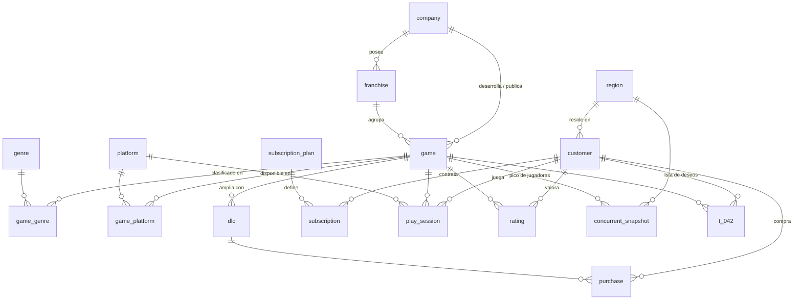

# Arcadia — base de datos objetivo del TFM

> **Estado: validada y en uso.** El esquema y los datos se cargan solos al levantar
> Docker (`02-schema.sql` + `03-dataset.sql`), el golden set completo (25 preguntas)
> se ejecuta contra la BD real en la evaluación experimental, y el seeder
> reproducible vive en `backend/src/datasets/seedArcadia.ts` (seed=42: 60 compañías,
> 320 juegos, 5 000 clientes, 80 000 sesiones, 55 000 snapshots).

Base de datos **propia** (sintética) que sirve de banco de pruebas para el sistema
NL→SQL. Modela una **plataforma de suscripción de videojuegos en streaming**
("Netflix de videojuegos"): catálogo de juegos incluidos en la suscripción, compras
puntuales de DLC y telemetría de uso.

## Por qué este dominio

- **Nombres sintéticos.** Juegos y compañías inventados (no reales), así que el
  modelo no puede acertar de memoria: al ser una BD que no existe en su
  entrenamiento, no hay contaminación.
- **Estructura de grafo natural.** Tablas unidas por claves foráneas (compañías,
  franquicias, juegos, géneros, plataformas, clientes, suscripciones, telemetría):
  un buen caso para vectorizar el esquema y navegarlo por el grafo en Neo4j.
- **Rico en métricas.** Ingresos (MRR de suscripción + DLC), jugadores
  concurrentes, playtime, valoraciones, churn y retención → preguntas variadas.
- **Multilingüe.** Esquema en inglés, preguntas en español (caso del TFM).
- **Una tabla deliberadamente opaca.** `t_042` (la lista de deseos) tiene un nombre
  que no dice nada a propósito: solo se localiza por su descripción o por sus claves
  foráneas. Es el caso de prueba del schema-linking por descripción.

## Esquema (17 tablas)



Definición completa y comentada en [schema.sql](schema.sql).

## Cómo se levanta

**No hay que hacer nada**: el `docker compose up -d` del proyecto crea la BD y carga
esquema + datos desde `setup/infra/postgres/init/` (ver la
[guía de instalación](../../../docs/instalacion.md)).

Solo si cambias el esquema o el volumen hace falta el seeder reproducible
(seed=42, misma semilla → mismos datos), que vive en el backend y usa sus
dependencias (un solo `npm install`):

```bash
cd backend
npm run seed -- --truncate    # repuebla arcadia (TARGET_DB_1)
```

> **Seguridad por diseño:** el seeder escribe con un usuario con permisos, pero el
> agente consulta siempre con una sesión de **solo lectura**.

## Golden set

[golden_set.yaml](golden_set.yaml) — **25 preguntas** ES→SQL (G-01..G-25) etiquetadas
por dificultad (`easy` / `medium` / `hard`) y con las tablas que la SQL correcta debe
tocar. La SQL de referencia es PostgreSQL de solo lectura; para comparar respuestas se
contrasta el **resultado**, no el texto de la consulta. Las agregaciones "por/cada
categoría" siguen la interpretación **inclusiva** (LEFT JOIN, las categorías vacías
salen — decisión D-13). G-25 apunta a la tabla opaca `t_042`.

Sirve para la evaluación experimental (`npm run evaluate`) y para probar el sistema a
mano: desde lookups simples hasta consultas multi-tabla (multi-hop de 3-4 tablas,
anti-joins, agregaciones).
