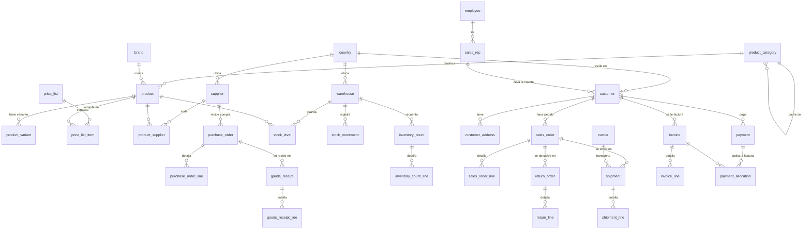

# Meridian — base de datos objetivo de dominio nuevo

> **Para qué la creé.** arcadia (17 tablas) y nebula (66 tablas) son ambas del
> universo de **videojuegos/media**. Meridian es una tercera BD objetivo en un
> **dominio a propósito distinto** —un **ERP de distribución mayorista B2B**— para
> comprobar algo que las otras dos no pueden: si el schema-linking y la generación de
> SQL **generalizan** a un esquema que el modelo no ha "visto" en ese dominio. Se carga
> sola al levantar Docker (`06-meridian-schema.sql` + `07-meridian-dataset.sql`), tiene
> golden set propio (24 preguntas) y seeder reproducible en
> `backend/src/datasets/seedMeridian.ts` (seed=42).

Base de datos **propia** (sintética) que modela un mayorista B2B: compras a
proveedores, inventario multi-almacén, ventas a clientes empresa, envíos con
transportista, devoluciones y facturación con cobros.

## Por qué este dominio

- **Dominio distinto para medir generalización.** El sistema ya iba fino en el
  dominio de videojuegos (arcadia/nebula); un ERP de distribución es vocabulario y
  relaciones diferentes, así que mide de verdad si el método aguanta fuera de casa.
- **Tamaño intermedio (41 tablas).** Queda entre arcadia (17) y nebula (66): un punto
  más en la curva de "cuánto crece el contexto y cae el recall con el esquema".
- **Nombres sintéticos.** Empresas y productos inventados (faker), sin datos reales,
  así que no hay contaminación por memorización del modelo.
- **Ambigüedades naturales de ERP.** Nombres parecidos a propósito para tensar el
  schema-linking: `warehouse_zone.kind` vs `sales_rep.region` vs `country.region`;
  `supplier_contact` vs `customer_contact`; direcciones de envío vs facturación.
- **Rico en métricas.** Facturación, ventas por comercial, valor de inventario a
  coste, desviaciones de recuento, devoluciones por motivo → preguntas variadas.
- **Multilingüe.** Esquema en inglés, preguntas en español (caso del TFM).

## Esquema (41 tablas)

Diez módulos: catálogos de referencia · organización (empleados/almacenes/comerciales)
· producto y tarifas · proveedores y compras · inventario · clientes · ventas · envíos
· devoluciones · facturación y cobros.



Definición completa y comentada en [schema.sql](schema.sql) (algunas tablas más del
diagrama: `currency`, `tax_rate`, `unit_of_measure`, `payment_term`, `department`,
`warehouse_zone`, `supplier_contact`, `customer_contact`).

## Cómo se levanta

**No hay que hacer nada**: el `docker compose up -d` crea la BD `meridian` y carga
esquema + datos desde `setup/infra/postgres/init/`. En el catálogo del CLI aparece como
una BD objetivo más; en el `.env.example` es `TARGET_DB_3` (en un `.env` que ya tenga
BDs propias, el número puede variar).

Solo si cambias el esquema o el volumen hace falta el seeder reproducible
(seed=42, misma semilla → mismos datos):

```bash
cd backend
npm run seed:meridian -- --reset   # recrea el esquema y repuebla meridian
```

> **Seguridad por diseño:** el seeder escribe con un usuario con permisos, pero el
> agente consulta siempre con una sesión de **solo lectura**.

## Golden set

[golden_set.yaml](golden_set.yaml) — **24 preguntas** ES→SQL (M-01..M-24) etiquetadas
por dificultad (6 `easy` / 10 `medium` / 8 `hard`), con las tablas que la SQL correcta
debe tocar (23 tablas distintas de las 41). La SQL de referencia es PostgreSQL de solo
lectura; para comparar se contrasta el **resultado**, no el texto. Las agregaciones
"por/cada X" siguen la interpretación **inclusiva** (LEFT JOIN — decisión D-13).

Para evaluar meridian de punta a punta:

```bash
cd backend
EVAL_TARGET=meridian npm run evaluate
```
